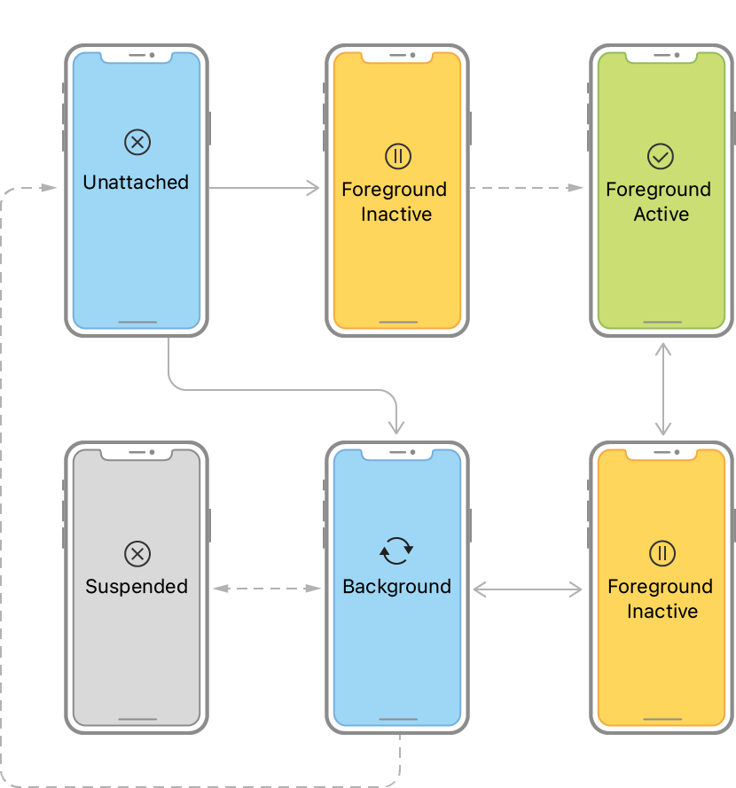
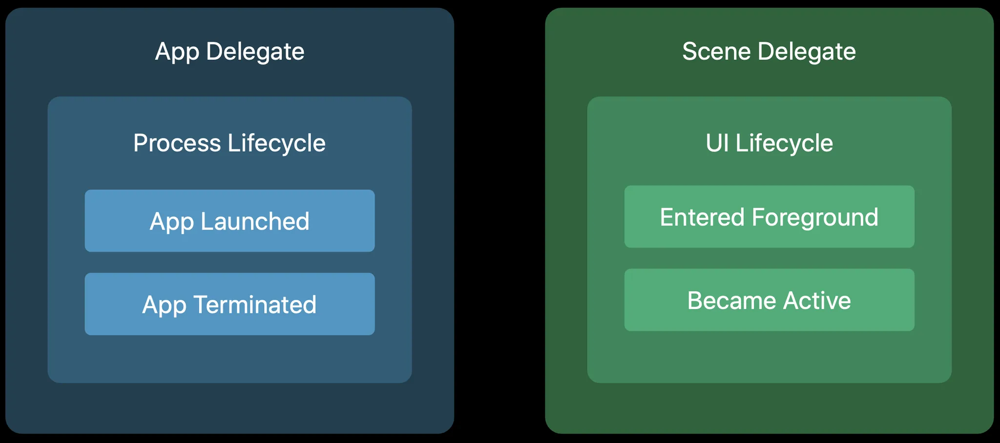

# iOS 앱이 동작하는 방법

## iOS 앱의 라이프사이클

- 앱은 사용자의 관심을 기다린다
- 사용자가 앱을 실행하면, 시스템은 해당 앱에 리소스를 몰아준다.
  - 포어그라운드 앱: 관심을 받고 있는 상태
  - 백그라운드 앱: 관심을 받고 있지 않은 상태
- 이렇게 앱의 상태는 사용자에 따라 바뀌게 되며, 이를 라이프사이클이라고 한다. 라이프사이클을 이해하고 적절히 대응하는 것이 중요하다.  
    
  참고: [UIKit - Managing your app’s life cycle](https://developer.apple.com/documentation/uikit/managing-your-app-s-life-cycle) 
  - 앱이 관심을 받고 있음: 포어그라운드 액티브
  - 앱 전환 등 잠시 관심을 떠남: 포어그라운드 인액티브
  - 앱에 대한 관심이 완전히 떠남: 백그라운드
  - 백그라운드 상태에서 오랜 시간이 지속됨: 서스펜디드   

&nbsp;

- 이러한 라이프사이클은 프로세스 라이프사이클과 UI 라이프사이클로 나눠서 생각해볼 수 있다.
  - 프로세스 라이프사이클: 애플리케이션 프로세스 입장에서의 라이프사이클
  - UI 라이프사이클: 윈도우 등 UI 요소 입장에서의 라이프사이클
- iOS 12 이전에는 앱 인스턴스마다 하나의 UI를 가지고 있어 두 개가 동일하게 App Delegate에서 관리되었으나,  
  iOS 13 이후 멀티 윈도우 도임 등으로 앱 인스턴스 한 개에 여러 윈도우가 존재할 수 있도록 변경되면서 App Delegate와 Scene Delegate가 분리되고 각각 프로세스 라이프사이클과 UI 라이프사이클에 대한 처리를 위임받게 된다.  
  

&nbsp;

- 개발자의 책임
  - 앱이 포어그라운드로 들어갈 때
    - 이니셜 UI 준비
    - 사용자와의 인터랙션 준비
  - 포어그라운드를 떠날 때
    - 데이터를 저장해둠
    - 앱의 작업을 최소화할 준비
  - 백그라운드로 들어갈 때
    - 앱의 주요 작업 중단
    - 메모리 비우기
    - 현재 상태를 저장해두고 다음에 다시 포어그라운드로 돌아올 때를 준비


## iOS에서 뷰의 역할과 그리는 방법

### 뷰의 역할

1. 앱이 가지고 있는 데이터를 사용자에게 보여준다
2. 사용자의 인터랙션을 받아서 앱에 알려준다

### 뷰 그리기

#### UI의 역사

```
Code    
-------------------------------------------------------->
        
        Nib    Xib    Storyboard
        ------------------------------------------------->

                                  SwiftUI (2019~)
                                  ----------------------->  
```

- Code: 코드로 직접 UI를 그리는 방법
- Nib: NeXT Interface Builder의 약자로, NeXT 시절 개발된 위지윅 개발 도구
- Xib: Nib의 개선판
- Storyboard: Xib의 개선판. Xib의 개선판으로 기업에서 많이 활용됨. 동시에 여전히 코드를 이용해 직접 그리는 방식도 많이 활용됨
- SwiftUI
  - UiKit의 단점을 해결
  - 새로운 패러다임의 개발 방식
  - 현재 Apple에서 밀고 있는 방식

#### 뷰 작업 방법 비교

- UIKit (Storyboard)
  - 장단점
    - 장점
      - 뷰를 위한 코드가 줄어든다
      - 뷰를 직관적으로 이해하기 쉽다
      - 뷰를 작업하는 속도가 빠르다
    - 단점
      - 작업 내용 보기가 어렵다 -> xml로 UI를 표현해서, Git에서 컨플릭트가 나면 xml을 직접 보면서 해결해야되는데 성가시다
      - 재사용성이 낮다
      - 뷰의 동적 변화에 있어서 제약이 있다
- UIKit (Code)
  여전히 코드를 이용해 직접 그리기도 한다.  
  - 장점
    - 작업 내용을 보기가 쉽다
    - 재사용성이 높다
    - 동적 변화에 있어 제약이 적다
  - 단점
    - 뷰를 위한 코드가 많이 들어간다
    - 코드만 보고서 뷰를 직관적으로 이해하기 어렵다
    - 뷰 작업 속도가 느리다 (다만 재사용성이 높아지므로 한 컴포넌트를 만들어두면 그 이후부터는 생산성 향상 기대 가능)
- SwiftUI
  - 장점
    - 작업 내용을 보기가 쉽다
    - 재사용성이 높다
    - 뷰를 위한 코드가 비교적 적게 들어간다
    - 뷰를 직관적으로 코드를 통해 이애하기 쉽다
    - 뷰 작업 속도가 빠르다
  - 단점
    - 아직도 UiKit 기반의 프로젝트가 많다
    - iOS 버전 별로 가능한 UI, 불가능한 UI가 있어서 버전별로 분기를 태워야 한다.

#### 결론

- Storyboard로 UIKit 개발할 때와, Code로 개발할 떄의 장단점 알아두기
- 아직 UIKit 프로젝트가 많기 때문에 결국 UIKit과 SwiftUI 둘 다 알아야 한다.
- UIKit 학습 -> SwiftUI 학습
