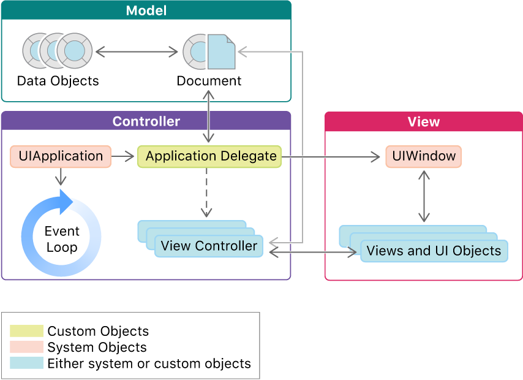

# UIKit을 이용한 앱개발

## 모델-뷰-컨트롤러

- UIKit 문서에 따르면, UIKit은 기본적으로 MVC 구조를 채택함
    
  참고: [UIKit - About App Development with UIKit](https://developer.apple.com/documentation/uikit/about-app-development-with-uikit)
- MVC 구조란?
  - 모델: 데이터를 저장
  - 뷰: 데이터를 표현
  - 컨트롤러: **뷰가 모델을, 또한 모델이 뷰를 직접 참조하게 하지 않고, 둘 사이에 컨트롤러를 두어 매개**함.  
  참고: [Cocoa Core Competencies - Model-View-Controller](https://developer.apple.com/library/archive/documentation/General/Conceptual/DevPedia-CocoaCore/MVC.html)
- 논의
  - MVC가 추천되는 구조이지만, 실무가 진행됨에 있어 일관적이고 좋은 구조가 유지되지 않는 문제가 발생하고 개발부채가 발생
  - 지속 가능한 더 좋은 구조에 대한 고민이 이뤄짐
    - 파생 디자인 패턴: MVVM, MVP, VIPER, Ribs
    - 클린 아키텍쳐 - 확장하기 쉬운 구조에 대한 고민
    - 멀티 모듈 아키텍쳐 - 대규모 슈퍼앱이 충돌없이 유지보수될 수 있는 방법에 대한 고민 (참고: [Airbnb - Designing for Productivity in a Large-Scale iOS Application](https://medium.com/airbnb-engineering/designing-for-productivity-in-a-large-scale-ios-application-9376a430a0bf))
  - 입문하는 입장에서는 전체 토픽에 대해 자세하게 알지 못하는 것이 당연하지만, MVVM이나 클린아키텍쳐는 공고에서 계속 등장하기 때문에 이 정도에 대해서는 배경과 방법을 알아둘 필요는 있겠음

## 첫 번째 앱

## 오토 레이아웃

### 개요

- 만들었던 씬에 대해 타겟 디바이스를 바꿔보면 각 요소가 표시되는 영역이 달라지는 것을 확인할 수 있다.
- 이런 식이라면, 디바이스별로 각 요소의 절대적인 좌표를 계산해줘야할 것이다.
- 오토 레이아웃을 활용하면 어떤 디바이스, 어떤 화면이든 적절하게 표시되도록 할 수 있다.

### 방법

- Constraint를 통해 오토 레이아웃을 적용할 수 있다.
- 적용하려면 뷰는 아래의 두 기준을 충족해야한다.
  1. 위치를 알 수 있어야 한다
  2. 크기를 알 수 있어야 한다

### 실습

- 크기 제약사항 추가  
    
  - 스토리보드 좌측에서 Ctrl을 누른 채 제약사항을 줄 요소를 선택하고 드래그하거나,
  - 스토리보드 하단에서 제약사항 추가

- 위치 제약사항 추가
    
  - 전체 뷰에 대해 위치를 잡고 싶은 경우,
  - 스토리보드 좌측에서 Ctrl을 누른 채 요소를 선택하고 View로 드래그
  - 원하는 제약사항을 추가
  - 각 요소에 대한 제약사항은 우측의 Size Inspector를 보면 확인할 수 있음

- 결과  
  

## 심볼 롤러 프로젝트

### StackView

- 여러 오브젝트를 수직으로/수평으로 함께 표시한다.
- 한 번에 배치하고 함께 제약사항을 걸어줄 수 있다.

### 뷰 컨트롤러

- 스토리보드 우측 상단에서 Assistant 버튼을 눌러 해당 뷰와 연결된 뷰 컨트롤러를 옆에 바로 열 수 있다.
- 이 상태에서 스토리보드 좌측의 오브젝트를 Ctrl을 누른 채 뷰 컨트롤러의 프로퍼티 영역으로 끌면, 뷰 컨트롤러와 해당 오브젝트를 연결할 수 있다. 목적에 따라 Connection을 outlet과 action 중 선택한다.
  - `@IBOutlet`: 오브젝트 자체를 참조변수로 연결
  - `@IBAction`: 오브젝트의 액션 함수를 메서드로 연결
- 뷰 컨트롤러를 새로 만들어 연결하려면,
  1. File - New - File From Template... - Cocoa Touch Class 템플릿 선택, UIViewController 상속
  2. 스토리보드의 디바이스 화면 상단 - 제일 왼쪽 버튼 누름 - 오른쪽에서 Custom Class 인스펙터 선택 - 새로 만든 뷰 컨트롤러를 Class에 입력
- 뷰의 라이프사이클에 따른 처리는 뷰 컨트롤러에서 viewDidLoad, viewWillAppear, viewDidAppear 등을 오버라이드하여 할 수 있다.

