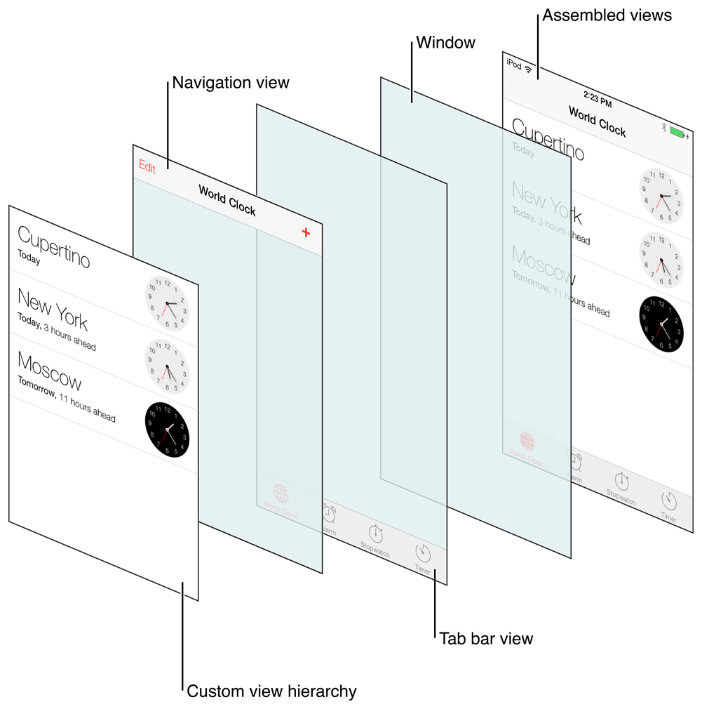
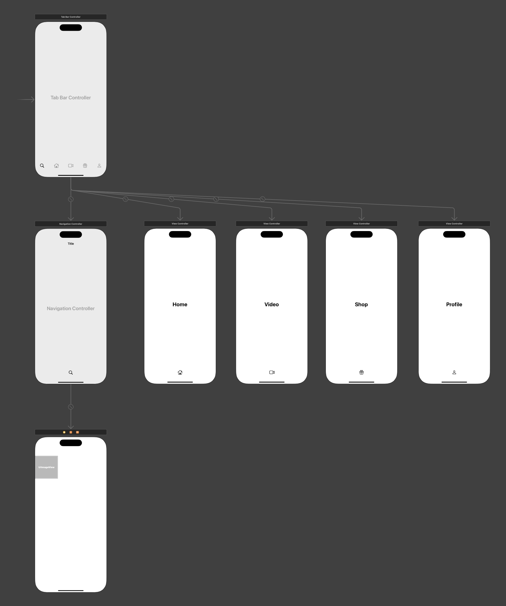

# 리스트 및 그리드 뷰 구성해보기

## 컬렉션뷰 이해하기

### 개요

- 리스트
- 그리드

### 구현

- UIKit에서는 UITableView, UICollectionView를 이용
- UITableView
  - 여러 데이터를 싱글 컬럼으로 나열하는 뷰
- UICollectionView
  - 여러 데이터를 여러 컬럼 또는 커스텀된 레이아웃으로 표현해주는 뷰 (예: 그리드뷰)
- 둘 다 학습 난이도는 비슷하며, UICollectionView의 자유도가 조금 더 높음. 강의에서는 UICollectionView를 다룸

### UICollectionView

- ⭐️ Data, Presentation, Layout만 알려주면 원하는 뷰를 그릴 수 있다.
- Data: 표현할 데이터
- Presentation: 하나의 셀에서 데이터를 어떻게 표현할지
- Layout: 여러 셀들을 어떤 레이아웃으로 배치할지

### 참고문서

- https://developer.apple.com/documentation/uikit/uitableview
- https://developer.apple.com/documentation/uikit/uicollectionview
- https://developer.apple.com/videos/play/wwdc2019/220/
- https://developer.apple.com/videos/play/wwdc2020/10045


## StockRank

- CollectionView를 오토 레이아웃으로 꽉 차게 넣고, 셀 하나를 그린다.
  - 셀 내부에 여러 오브젝트를 넣고 오토 레이아웃으로 배치한다.
  - 셀과의 관계에 따라 제약조건을 줘도 되고, 인접 오브젝트와의 관계에 따라 제약조건을 줘도 된다.
- 뷰 컨트롤러에 CollectionView를 프로퍼티로 연결한다.
  - viewDidLoad에서 해당 컬렉션 뷰의 dataSource와 delegate를 self(뷰 컨트롤러)로 둔다.
  - 뷰 컨트롤러가 UICollectionViewDataSource, UICollectionViewDelegateFlowLayout 프로토콜을 준수하도록 익스텐션으로 구현해준다.
    - UICollectionViewDataSource: CollectionView::dataSource의 타입
      - `collectionView(_:numberOfItemsInSection:)`: 특정 섹션에 대해 데이터 수가 몇 개인지 반환한다. 우리는 섹션 한 개이므로 단순히 stockList의 count를 반환
      - `collectionView(_:cellForItemAt:)`: 특정 인덱스에 해당하는 셀을 어떻게 표현할 것인지. 
    - UICollectionViewDelegateFlowLayout: CollectionView::Delegate의 타입인 UICollectionViewDelegate를 준수하는 하위 프로토콜
      - `collectionView(_:layout:sizeForItemAt:)`: 하나의 셀의 사이즈를 반환한다. 우리는 컬럼 한 개의 리스트를 만들고 있기 때문에 다음과 같이 작성한다.   
        ```swift
        func collectionView(_ collectionView: UICollectionView, layout collectionViewLayout: UICollectionViewLayout, sizeForItemAt indexPath: IndexPath) -> CGSize {
            // width는 컬렉션 뷰의 너비와 같다. 컬럼이 1개이기 때문.
            // height는 80
            return CGSize(width: collectionView.bounds.width, height: 80) // UIView::bounds는 사각형 객체의 위치와 사이즈 정보를 담고 있다.
        }
        ```
- UICollectionViewCell을 상속받는 StockRankCollectionViewCell 클래스를 만들고, 스토리보드에서 셀의 뷰 컨트롤러로 연결해준다. 또한 셀에 대해 어트리뷰트 인스펙터를 열면 리유저뷸 뷰에 대한 식별자를 지정할 수 있다. 클래스 이름을 그대로 주면 편하다. (StockRankCollectionViewCell)
- 어시스턴트 뷰에서 StockRankCollectionViewCell에 각종 오브젝트를 연결해준다.   
  ```swift
  @IBOutlet weak var rankLabel: UILabel!
  @IBOutlet weak var companyIconImageView: UIImageView!
  @IBOutlet weak var companyNameLabel: UILabel!
  @IBOutlet weak var companyPriceLabel: UILabel!
  @IBOutlet weak var diffLabel: UILabel!
  ```
- Stock 구조체를 받으면 해당 셀의 UI를 업데이트해주는 메서드 configure(_)를 구현한다.   
  ```swift
  func configure(_ stock: StockModel) {
      rankLabel.text = "\(stock.rank)"
      companyIconImageView.image = UIImage(named: stock.imageName)
      companyNameLabel.text = stock.name
      companyPriceLabel.text = "\(convertToCurrencyFormat(price: stock.price))원"
      diffLabel.text = "\(stock.diff)%"
  }
  
  func convertToCurrencyFormat(price: Int) -> String {
      let numberFormatter = NumberFormatter()
      numberFormatter.numberStyle = .decimal
      numberFormatter.maximumFractionDigits = 0
      return numberFormatter.string(from: NSNumber(value: price)) ?? ""
  }
  ```
  - [NumberFormatter](https://developer.apple.com/documentation/foundation/numberformatter/)를 이용해 가격을 포매팅하도록 구현했다.
- 뷰 컨트롤러로 돌아가 `collectionView(_:cellForItemAt:)`를 구현해준다.
  - CollectionView::dequeueReusableCell(withReuseIdentifier:for:)를 이용해 해당 컬렉션 뷰에 등록된 재사용 셀을 가져온다. 식별자를 위에서 등록한 `StockRankCollectionViewCell`으로 준다.
  - 이때 타입이 UICollectionViewCell이다. 우리가 만든 커스텀 클래스인 StockRankCollectionViewCell로 캐스팅한다.
  - 구현해둔 UI 업데이트 메서드 StockRankCollectionViewCell::configure를 호출한다. 인자로는 stockList[indexPath.item]를 넘긴다.
    - indexPath는 해당 셀의 섹션, 로우, 로우 내에서 몇 번째인지(.item) 등을 표현한다.
  ```swift
  func collectionView(_ collectionView: UICollectionView, cellForItemAt indexPath: IndexPath) -> UICollectionViewCell {
      // CollectionView에 등록된 재사용 가능한 셀을 가져오고, 상속한 클래스로 캐스팅한다.
      guard let cell = collectionView.dequeueReusableCell(withReuseIdentifier: "StockRankCollectionViewCell", for: indexPath) as? StockRankCollectionViewCell else {
          return UICollectionViewCell()
      }
      
      cell.configure(stockList[indexPath.item]) // IndexPath에는 섹션이 무엇인지, 그리고 해당 섹션의 몇 번쨰 아이템인지 정보가 담겨져 있다.
      
      return cell
  }
  ```

### 더 공부할 것

- 스위프트에서의 [타입 캐스팅](https://docs.swift.org/swift-book/documentation/the-swift-programming-language/typecasting)
- [NumberFormatter](https://developer.apple.com/documentation/foundation/numberformatter/)

### 과제

- diff가 음수이면 파란색으로 표시
  - StockRankCollectionViewCell::configure에 한 줄을 추가했다.
    ```swift
    // diffLabel.textColor = stock.diff > 0 ? .red : .blue
    diffLabel.textColor = stock.diff > 0 ? .systemRed : .systemBlue
    ```


## ChatList

- 앞선 프로젝트와 유사했다.
- 노트
  - [UICollectionViewFlowLayout::estimatedItemSize](https://developer.apple.com/documentation/uikit/uicollectionviewflowlayout/estimateditemsize)
    - UICollectionViewDelegateFlowLayout을 채택해 `collectionView(_:layout:sizeForItemAt:)`를 적절히 구현했음에도 셀의 너비가 스크린을 넘어가는 경우가 발생했다.  
       
       - 몇 번 화면을 회전하고 스크롤을 하면 알맞은 사이즈를 찾아간다.
    - 강의에서는 CollectionView의 사이즈 인스펙터에서 Estimate Size를 Automatic에서 None으로 변경하여 해결했다. (또는 코드에서 `layout.estimatedItemSize = .zero`)  
      Automatic으로 하면 시스템이 임의로 계산한 값이 들어가는 모양이다.
    - 관련 문서
      - [Xcode 11에 생긴 Self-Size Cell 의 Estimate Size 는 무엇일까?](https://yagom.net/forums/topic/xcode-11에-생긴-self-size-cell-의-estimate-size-는-무엇일까/) 
      - [Why on Xcode 11, UICollectionViewCell changes size as soon as you scroll (I already set size in sizeForItem AtIndexPath:)?](https://stackoverflow.com/questions/56840665/why-on-xcode-11-uicollectionviewcell-changes-size-as-soon-as-you-scroll-i-alre/58369142#58369142)
  - `Content Compression Resistance Priority`
    - 오토 레이아웃 제약 조건 상, 다른 오프젝트와의 간섭 등으로 원래 크기(Intrinsic Size)보다 작아져야할 때 우선순위를 정한다. 이 값이 작은 오브젝트가 더 줄어든다. 사이즈 인스펙터에서 지정할 수 있다.
    - 이번 프로젝트에서는 채팅 내용이 표시되는 레이블과 날짜가 표시되는 레이블의 우선순위가 기본값대로 서로 같으면 (750) 날짜가 가려지는 문제가 발생했다.
    - 채팅 내용 레이블의 `Content Compression Resistance Priority`를 250 정도로 줄여서 해결했다.
    - 상반되는 속성으로 `Content Hugging Priority`가 있다. 이 값은 반대로 원래 크기보다 늘어나야할 때 우선순위를 정한다. 이 값이 작은 오브젝트가 더 늘어난다.
    - 강의에서는 이 개념에 대해 문서만으로 이해하기는 어렵기 때문에, 직접 스토리보드에 두 가지 오브젝트를 놓고 여러 제약조건을 줘 가면서 테스트해보는 것을 권했다.
  - [DateFormatter](https://developer.apple.com/documentation/foundation/dateformatter)를 이용한 날짜 형식 변환
    - Chat 원본 데이터에는 날짜가 "yyyy-MM-dd" 꼴의 문자열이었는데, 완성 스크린샷을 보면 "M/d" 형태로 표시되어야 했다.
    - DateFormatter를 이용해 문자열을 Date 객체로 바꾸고, 이를 다시 "M/d" 꼴의 문자열로 반환하도록 구현했다.  
      ```swift
      func formattedDateString(dateString: String) -> String {
          let formatter = DateFormatter() // see: https://developer.apple.com/documentation/foundation/dateformatter
          formatter.dateFormat = "yyyy-MM-dd"
          
          // 먼저 문자열을 Date로 변환
          guard let date = formatter.date(from: dateString) else { return "" }
          
          // Date를 다시 문자열로 변환
          formatter.dateFormat = "M/d"
          return formatter.string(from: date)
      }
      ```
    - [awakeFromNib()](https://developer.apple.com/documentation/objectivec/nsobject/1402907-awakefromnib)
      - 재사용 셀의 커스텀 클래스에 이 메서드를 오버라이드하여 구현했다.
      - 문서를 보면 Nib 파일에서 UI 로드되었을 때 호출되는 것으로 보인다. Nib 파일은 스토리보드로 만든 UI 객체가 바이너리 상태로 컨버팅된 파일이라는 것 같다.
      - 강의에서는 재사용 셀이 deeque되어 로드되면 이 메서드가 호출된다고 하였고, 여기서 썸네일 이미지뷰에 대한 cornerRadius를 지정했다.
        ```swift
        // 스토리보드에서 재사용 셀이 deque될 때 호출됨
        override func awakeFromNib() {
            thumbnailImage.layer.cornerRadius = 10
        }
        ```
- 과제
  - 채팅 리스트를 날짜 기준 내림차순으로 정렬해 표시하기
    - Array의 내장 메서드인 sorted를 이용하면 된다. viewDidLoad에서 수행했다. 이때 Chat::date는 String이므로 사전순 내림차로 정렬될 것이다.
      ```swift
      // 데이터 정렬
      chatDataList = Chat.list.sorted {
          $0.date > $1.date
      }
      ```


## AppleFramework

- 컬럼이 한 개가 아니라 여러 개라는 점에서 이전 프로젝트들과 달랐다.
- 다만 크게 어려운 부분은 없었다. 컬럼 수를 명시하기보다 width와 spacing만 적절하게 주면 그리드에 맞게 잘 배치해준다.

&nbsp;

### 컬렉션 뷰
- `UICollectionViewDelegateFlowLayout` 구현
  ```swift
  extension FrameworkListViewController: UICollectionViewDelegateFlowLayout {
      // 셀들을 어떻게 배치할지
      func collectionView(_ collectionView: UICollectionView, layout collectionViewLayout: UICollectionViewLayout, sizeForItemAt indexPath: IndexPath) -> CGSize {
          /*
              cell     cell     cell
           x [    ] v [    ] v [    ] x
           padding  space    space    padding
          */
          
          let interItemSpacing: CGFloat = 10
          let padding: CGFloat = 16
          
          let width = (collectionView.bounds.width - interItemSpacing * 2 - padding * 2) / 3 // 한 셀의 너비는 전체 컬렉션뷰 너비에서 셀 사이의 간격과 좌우 패딩을 제외한 길이를 3으로 나눈 값
          let height = width * 1.5
          
          return CGSize(width: width, height: height)
      }
      
      // 셀간 간격
      func collectionView(_ collectionView: UICollectionView, layout collectionViewLayout: UICollectionViewLayout, minimumInteritemSpacingForSectionAt section: Int) -> CGFloat {
          return 10
      }
      
      // 로우간 간격
      func collectionView(_ collectionView: UICollectionView, layout collectionViewLayout: UICollectionViewLayout, minimumLineSpacingForSectionAt section: Int) -> CGFloat {
          return 10
      }
  }
  ```
- 컬렉션 뷰의 Estimate Size 코드로 주기
  - viewDidLoad에서,
    ```swift
    if let flowlayout = collectionView.collectionViewLayout as? UICollectionViewFlowLayout {
        flowlayout.estimatedItemSize = .zero // None
    }
    ```
  - UICollectionViewLayout를 UICollectionViewFlowLayout로 캐스팅할 수 있다면, UICollectionViewFlowLayout의 프로퍼티인 estimatedItemSize를 0으로 지정
    - 이런 방식의 레이아웃을 UICollectionViewFlowLayout로 지정함을 알 수 있었다. 실제로 스토리보드에도 Collection View에 Collection View Flow Layout 항목이 있다.
  - 사이즈 인스펙터가 아니라 코드로 지정하면 동료나 미래의 내가 인스펙터를 열어보지 않아도 코드만으로 명시한 내용을 알 수 있다는 장점이 있다.
- 컬렉션 뷰의 제약조건을 Safe Area가 아니라 Superview에 대해 지정  
  
  - 제약조건을 Superview에 대해 지정하면 노치 등까지 셀이 노출된다.

### 네비게이션 바

- 과제 완성 스크린샷을 보면 상단 네비게이션 바가 있다.
- 네이게이션 컨트롤을 추가하면 이 뷰가 네비게이션 컨트롤러가 제어하는 뷰로 등록되고, 타이틀 바가 위에 나타난다.  
  
- 네비게이션 컨트롤러의 타이틀 오브젝트의 어트리뷰트 인스펙터에서 Prefers Large Titles에 체크하면 화면과 같은 모습이 된다.

### 시뮬레이터

- 시뮬레이터에서 Cmd + Shift + A를 누르거나, Features - Toggle Apperance를 눌러 라이트 모드 - 다크 모드를 전환할 수 있다.

### 과제

- 컬럼 두 개, 컬럼 네 개로도 만들어보기
  ```swift
  // 컬럼 세 개
  let width3 = (collectionView.bounds.width - interItemSpacing * 2 - padding * 2) / 3
  
  // 컬럼 두 개
  let width2 = (collectionView.bounds.width - interItemSpacing * 1 - padding * 2) / 2
  
  // 컬럼 네 개
  let width4 = (collectionView.bounds.width - interItemSpacing * 3 - padding * 2) / 4
  ```
- 컬럼이 네 개이면 이름이 다음 줄로 넘어가는 경우  
  ```swift
  override func awakeFromNib() {
    super.awakeFromNib()
    nameLabel.numberOfLines = 1
    nameLabel.adjustsFontSizeToFitWidth = true
  }
  ```
  - 저번 시간 등장한 awakeFromNib를 오버라이드하고 numberOfLines를 1로, adjustsFontSizeToFitWidth를 true로 설정했다.  
  

### 고도화

- 셀을 탭 했을 때 추가 정보 표시
  ```swift
  extension FrameworkListViewController: UICollectionViewDelegate {
      func collectionView(_ collectionView: UICollectionView, didSelectItemAt indexPath: IndexPath) {
          print(data[indexPath.item])
      }
  }
  ```
  - `UICollectionViewDelegate`의 `collectionView(_:didSelectItemAt:)`를 구현하면, 어떤 셀이 선택되었을 때 해당 셀의 IndexPath를 받을 수 있다.
- 네비게이션 바의 타이틀을 코드로 변경하기
  ```swift
  navigationController?.navigationBar.topItem?.title = "🍎 애플 프레임워크"
  ```
  - 이전에 네비게이션 컨트롤러를 임베드했기 때문에 nil이 아니다.

### 참고자료

- [UIKit - UINavigationController](https://developer.apple.com/documentation/uikit/uinavigationcontroller)

## 하단 탭바

- 더 많은 뷰를 보여주고자 할 때 사용한다.
- 구현
  - `UITabbarController` 이용
  - `UITabbarController` 인스턴스에 여러 개의 뷰 컨트롤러를 등록할 수 있다.
   - [setViewControllers(_:animated:)](https://developer.apple.com/documentation/uikit/uitabbarcontroller/setviewcontrollers(_:animated:)) 메서드로 코드로 뷰 컨트롤러들을 설정할 수 있다.
   - [viewControllers](https://developer.apple.com/documentation/uikit/uitabbarcontroller/viewcontrollers) 프로퍼티로 뷰 컨트롤러를 확인할 수 있다.
  - [selectedIndex](https://developer.apple.com/documentation/uikit/uitabbarcontroller/selectedindex) 프로퍼티를 통해 현재 선택된 뷰 컨트롤러를 알 수 있다.
  - 탭 바의 각 아이템은 `UITabBarItem`으로 구성된다.
    - 각 뷰 컨트롤러에서 image, title 프로퍼티를 설정해줄 수 있다.
    - 이미지 단독으로만 넣을 수도 있고, 타이틀도 같이 넣을 수도 있다.



## InstaSearchView

- 첫번째 검색뷰까지는 이전 프로젝트와 거의 비슷하게 진행하면 된다.
- 탭바
  - 상단 메뉴에서 탭바를 임베드한다.  
    
  - 네 개의 ViewController를 추가하고, 아래처럼 탭바 컨트롤러와 각 뷰 컨트롤러를 연결해 연결해준다.  
      
    - 탭바 컨트롤러를 선택한 상태에서, Ctrl을 누른 채 뷰 컨트롤러로 드래그한다.
    - 나타나는 드롭 메뉴에서 Relationship Segue - view controllers를 누른다.
  - 각 뷰 큰트롤러에 Tab Bar Item 항목이 추가되어 있다. 이것을 선택하고 어트리뷰트 인스펙터보면 Image와 Title을 지정할 수 있다.
  - Tab Bar Controller - Tab Bar의 어트리뷰트 인스펙터에서 Image Tint를 지정해 탭바 아이콘과 타이틀의 색상을 지정할 수 있다. Label Color로 지정하면 시스템이 다크모드인지 라이트모드인지에 따라 동적으로 지정된다.
- 네비게이션 컨트롤러 추가
  - 첫 번째 서치 뷰 컨트롤러는 네비게이션 컨트롤러에 포함되어 있다.
  - 이전 프로젝트에서 했던 것 처럼 서치 뷰 컨트롤러를 선택한 상태에서 네비게이션 컨트롤러를 임베드한다.
  - 탭 바 컨트롤러가 네비게이션 컨트롤러를 포함하도록 연결한다.
- 서치 뷰에 서치 바 추가
  - 다음과 같이 [UISearchController](https://developer.apple.com/documentation/uikit/uisearchcontroller) 객체를 만들고, `self.navigationItem.searchController`에 할당한다.
    ```swift
    let searchController = UISearchController(searchResultsController: nil)
    searchController.hidesNavigationBarDuringPresentation = false
    searchController.searchBar.placeholder = "Search"
    searchController.searchResultsUpdater = self
    self.navigationItem.searchController = searchController
    ```
    - `searchResultsUpdater`에 self를 할당하려면 self가 UISearchResultsUpdating 프로토콜을 준수해야한다. 다음과 같이 검색어를 콘솔에 출력하도록만 구현했다.  
      ```swift
      extension SearchViewController: UISearchResultsUpdating {
          func updateSearchResults(for searchController: UISearchController) {
              let search = searchController.searchBar.text // SearchController::searchBar -- UISearchBar
              print("search: \(search ?? "")")
          }
      }
      ```
    - [UIViewController::navigationItem](https://developer.apple.com/documentation/uikit/uiviewcontroller/navigationitem)에 대해서는 구체적인 설명은 없는데, 문서에 따르면 부모의 네비게이션 바의 뷰 컨트롤러를 나타낸다고 정의되어 있다.




- 과제 - 홈 뷰 구현
  - 컬럼 한 개의 컬렉션 뷰를 만드는 것이어서 그다지 어렵지 않았다.
  - 강사님과 달랐던 부분
    1. 피드 이미지 뷰의 제약조건을 Aspect로 주는 부분 (4:3)
    2. collectionView(_:layout:sizeForItemAt:) 구현
      ```swift
      func collectionView(_ collectionView: UICollectionView, layout collectionViewLayout: UICollectionViewLayout, sizeForItemAt indexPath: IndexPath) -> CGSize {
          let width = collectionView.bounds.width
          let height = width * 3/4 + 56 // 이미지 높이(=너비의 3/4)에 유저 썸네일 높이와 위아래 패딩을 더한 값
          return CGSize(width: width, height: height)
      }
      ```
      - 나는 대략적인 임의의 값으로 높이를 잡았는데, 강의에서는 width를 기준으로 상대적으로 hight를 계산해서 반환했다. 유지보수 측면이나 UI 이슈 대응에 있어 더 좋은 방법 같다.

### Xcode Tip

- `Ctrl + I`: Re-Indent. 들여쓰기가 이상하면 다시 정렬해준다.
