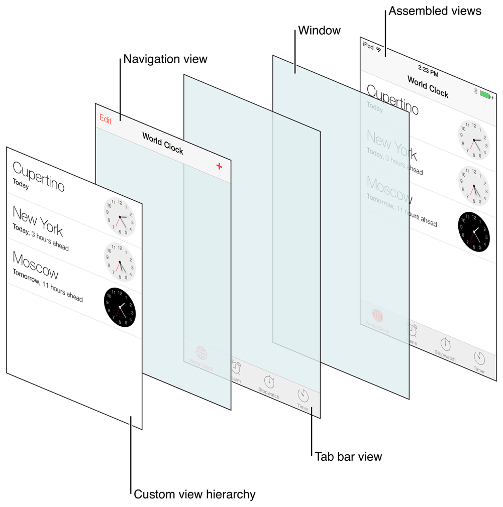
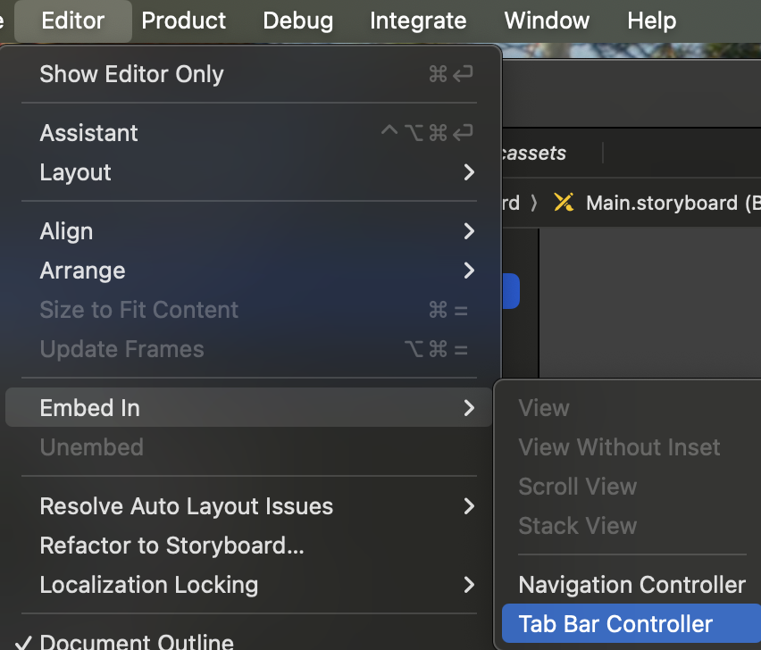
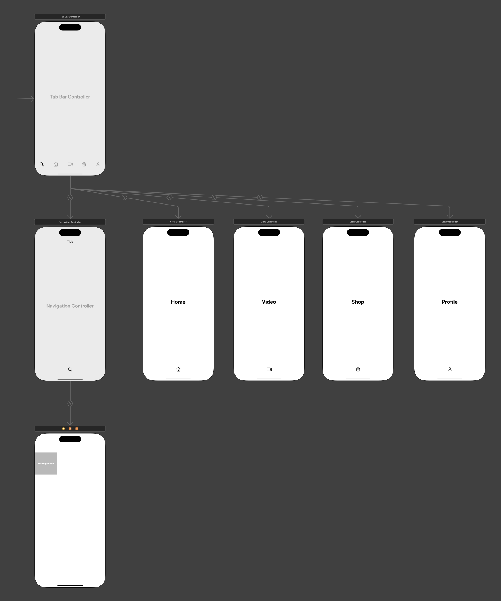
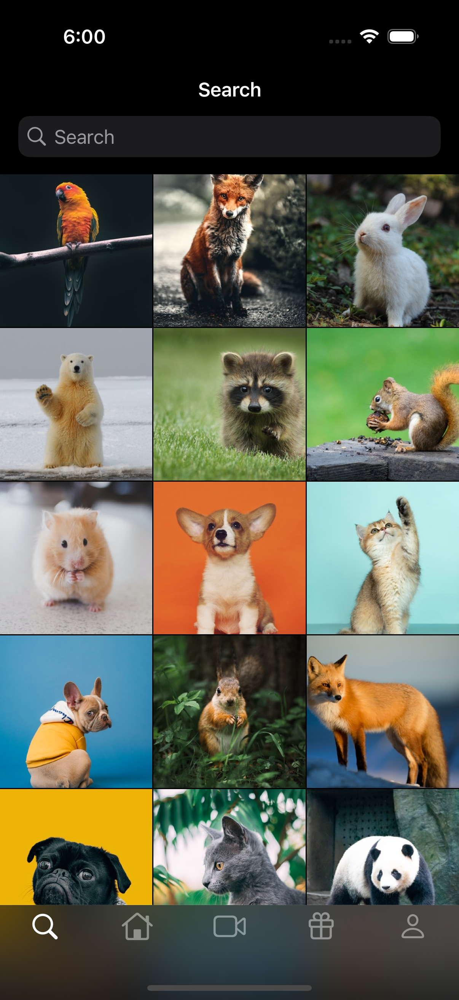

# 탭바가 있는 앱 구성해보기

## 하단 탭바

- 탭바는 더 많은 뷰를 보여주고자 할 때 사용한다.
- 구현
  - `UITabbarController` 이용
  - `UITabbarController` 인스턴스에 여러 개의 뷰 컨트롤러를 등록할 수 있다.
   - [setViewControllers(_:animated:)](https://developer.apple.com/documentation/uikit/uitabbarcontroller/setviewcontrollers(_:animated:)) 메서드로 코드로 뷰 컨트롤러들을 설정할 수 있다.
   - [viewControllers](https://developer.apple.com/documentation/uikit/uitabbarcontroller/viewcontrollers) 프로퍼티로 뷰 컨트롤러를 확인할 수 있다.
  - [selectedIndex](https://developer.apple.com/documentation/uikit/uitabbarcontroller/selectedindex) 프로퍼티를 통해 현재 선택된 뷰 컨트롤러를 알 수 있다.
  - 탭 바의 각 아이템은 `UITabBarItem`으로 구성된다.
    - 각 뷰 컨트롤러에서 image, title 프로퍼티를 설정해줄 수 있다.
    - 이미지 단독으로만 넣을 수도 있고, 타이틀도 같이 넣을 수도 있다.



## InstaSearchView

- 첫번째 검색뷰까지는 이전 프로젝트와 거의 비슷하게 진행하면 된다.
- 탭바
  - 상단 메뉴에서 탭바를 임베드한다.  
    
  - 네 개의 ViewController를 추가하고, 아래처럼 탭바 컨트롤러와 각 뷰 컨트롤러를 연결해 연결해준다.  
      
    - 탭바 컨트롤러를 선택한 상태에서, Ctrl을 누른 채 뷰 컨트롤러로 드래그한다.
    - 나타나는 드롭 메뉴에서 Relationship Segue - view controllers를 누른다.
  - 각 뷰 큰트롤러에 Tab Bar Item 항목이 추가되어 있다. 이것을 선택하고 어트리뷰트 인스펙터보면 Image와 Title을 지정할 수 있다.
  - Tab Bar Controller - Tab Bar의 어트리뷰트 인스펙터에서 Image Tint를 지정해 탭바 아이콘과 타이틀의 색상을 지정할 수 있다. Label Color로 지정하면 시스템이 다크모드인지 라이트모드인지에 따라 동적으로 지정된다.
- 네비게이션 컨트롤러 추가
  - 첫 번째 서치 뷰 컨트롤러는 네비게이션 컨트롤러에 포함되어 있다.
  - 이전 프로젝트에서 했던 것 처럼 서치 뷰 컨트롤러를 선택한 상태에서 네비게이션 컨트롤러를 임베드한다.
  - 탭 바 컨트롤러가 네비게이션 컨트롤러를 포함하도록 연결한다.
- 서치 뷰에 서치 바 추가
  - 다음과 같이 [UISearchController](https://developer.apple.com/documentation/uikit/uisearchcontroller) 객체를 만들고, `self.navigationItem.searchController`에 할당한다.
    ```swift
    let searchController = UISearchController(searchResultsController: nil)
    searchController.hidesNavigationBarDuringPresentation = false
    searchController.searchBar.placeholder = "Search"
    searchController.searchResultsUpdater = self
    self.navigationItem.searchController = searchController
    ```
    - `searchResultsUpdater`에 self를 할당하려면 self가 UISearchResultsUpdating 프로토콜을 준수해야한다. 다음과 같이 검색어를 콘솔에 출력하도록만 구현했다.  
      ```swift
      extension SearchViewController: UISearchResultsUpdating {
          func updateSearchResults(for searchController: UISearchController) {
              let search = searchController.searchBar.text // SearchController::searchBar -- UISearchBar
              print("search: \(search ?? "")")
          }
      }
      ```
    - [UIViewController::navigationItem](https://developer.apple.com/documentation/uikit/uiviewcontroller/navigationitem)에 대해서는 구체적인 설명은 없는데, 문서에 따르면 부모의 네비게이션 바의 뷰 컨트롤러를 나타낸다고 정의되어 있다.





- 과제 - 홈 뷰 구현
  - 컬럼 한 개의 컬렉션 뷰를 만드는 것이어서 그다지 어렵지 않았다.
  - 강사님과 달랐던 부분
    1. 피드 이미지 뷰의 제약조건을 Aspect로 주는 부분 (4:3)
    2. collectionView(_:layout:sizeForItemAt:) 구현
      ```swift
      func collectionView(_ collectionView: UICollectionView, layout collectionViewLayout: UICollectionViewLayout, sizeForItemAt indexPath: IndexPath) -> CGSize {
          let width = collectionView.bounds.width
          let height = width * 3/4 + 56 // 이미지 높이(=너비의 3/4)에 유저 썸네일 높이와 위아래 패딩을 더한 값
          return CGSize(width: width, height: height)
      }
      ```
      - 나는 대략적인 임의의 값으로 높이를 잡았는데, 강의에서는 width를 기준으로 상대적으로 hight를 계산해서 반환했다. 유지보수 측면이나 UI 이슈 대응에 있어 더 좋은 방법 같다.

### Xcode Tip

- `Ctrl + I`: Re-Indent. 들여쓰기가 이상하면 다시 정렬해준다.
