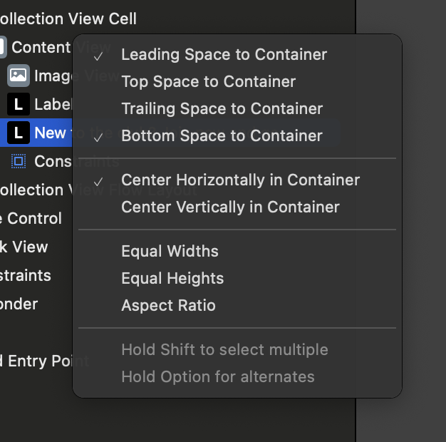
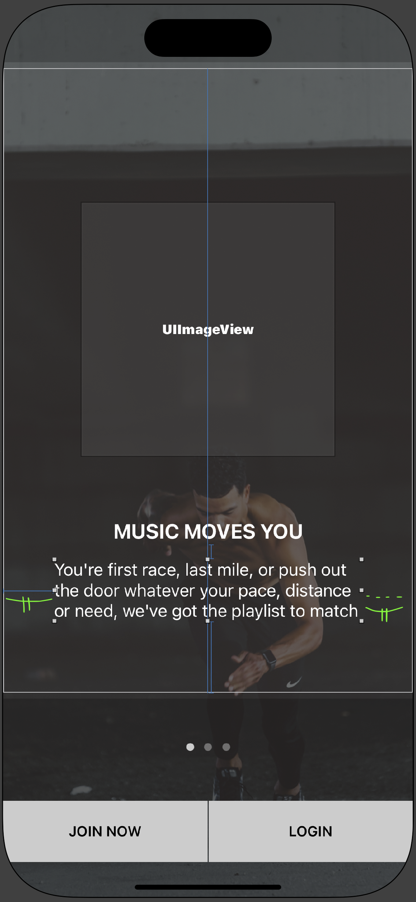
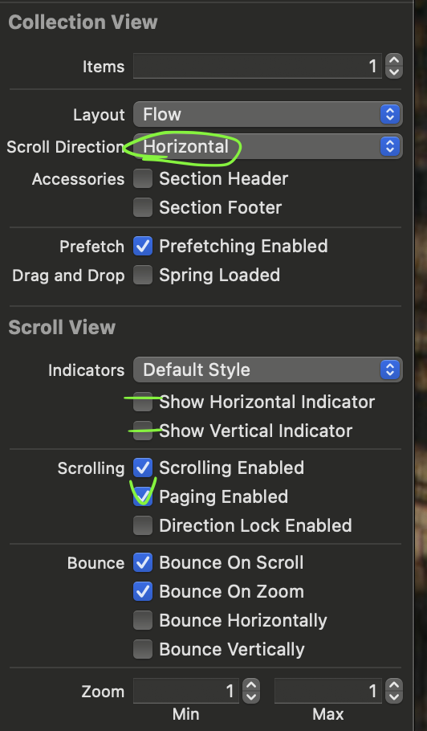

# 페이징 뷰 구성하기

## 프로젝트 NRC 온보딩

### 디자인

- 배경 이미지가 있기 때문에 먼저 ImageView를 제일 아래에 깐다.
- 두 개의 버튼은 StackView로 배치하고, 상위 뷰에 대해 제약조건을 준다. leading, trailling, bottom
- 페이지 컨트롤을 그 위에 배치하고, 스택 뷰와 vertical spaicing을 준다.
- 컬렉션 뷰를 그 위에 배치하고, 상위 뷰와 상하좌 제약조건을 주되, 페이지 컨트롤에 대해 vetical spacing을 준다. 셀은 뷰를 채우도록 늘린다.
- 셀에 메인 이미지 뷰를 배치하고, 사이즈 제약조건으로 250*250을 준다. 상위 뷰와 수평 수직으로 가운데 조건을 준 뒤, 수직 가운데 제약조건에 대해 Constant를 -50 정도 두어 조금 위로 올라가도록 한다.
- 설명 레이블을 배치한다.
  - 부모 뷰와 Leading space를 준 상태에서 Center horizentally를 주면 Leading space만큼 Trailing space가 적용되는 효과가 있다.
    
    
  - 부모 뷰에 bottom 제약조건을 준다.
- 타이틀 레이블을 배치한다. 설명 레이블에 대해 bottom 제약조건을 준다.

&nbsp;

- 컬렉션 뷰를 좌우로 스크롤 가능한 페이지 뷰로 만들기  
    
  - 스크롤 방향을 수평으로 변경한다 -> 상하에서 좌우로 방향이 변경됨
  - 인디케이터를 모두 비활성화한다 -> 스크롤바가 생기지 않음
  - Paging Enabled를 활성화한다 -> 각 셀이 나뉘어 페이징됨

&nbsp;

- 페이지 컨트롤 다루기
  - 뷰 컨트롤러에 연결하고 numberOfPages 속성을 데이터의 총 개수로 준다.
    ```swift
    // 생략
    @IBOutlet weak var pageControl: UIPageControl!
    
    override func viewDidLoad() {
        // 생략

        pageControl.numberOfPages = messageList.count
    }
    ```
  - 뷰 컨트롤러가 UIScrollViewDelegate를 따르도록 익스텐션을 만든 뒤에, scrollViewDidEndDecelerating(\_:)을 구현한다.
    - UICollectionView는 UIScrollView를 상속하고 있어서, UIScrollViewDelegate를 통해 위임받을 수 있다.
    - scrollViewDidEndDecelerating(\_:)는 스크롤 되다가 가속도가 줄어들고 멈췄을 때 호출된다. 비슷하게 scrollViewDidScroll(\_:)는 스크롤이 될 때마다 호출된다. 우리는 스크롤 애니메이션이 끝난 뒤 페이지 컨트롤을 업데이트할 것이기 때문에 전자를 쓴다.
    - 인자로 들어오는 scrollView(UIScrollView)의 속성 중 contentOffset은 현재 얼마나 페이징 되었는지, 오프셋을 CGFloat으로 표현한다. -> x 좌표 오프셋, y 좌표 오프셋
      - 오직 수평 스크롤이므로 여기서는 x 오프셋만 변할 것이다.
      - 컬렉션 뷰의 너비와 x 오프셋의 관계를 생각하면, 이 메서드가 호출되었을 때 현재 화면에 표시되고 있는 항목의 인덱스를 계산할 수 있다. `let index = Int(scrollView.contentOffset.x / self.collectionView.bounds.width)`
      - 계산한 값을 페이지 컨트롤의 currentPage 속성에 할당한다.
        ```swift
        func scrollViewDidEndDecelerating(_ scrollView: UIScrollView) {
            let index = Int(scrollView.contentOffset.x / self.collectionView.bounds.width)
            self.pageControl.currentPage = index
        }
        ```
