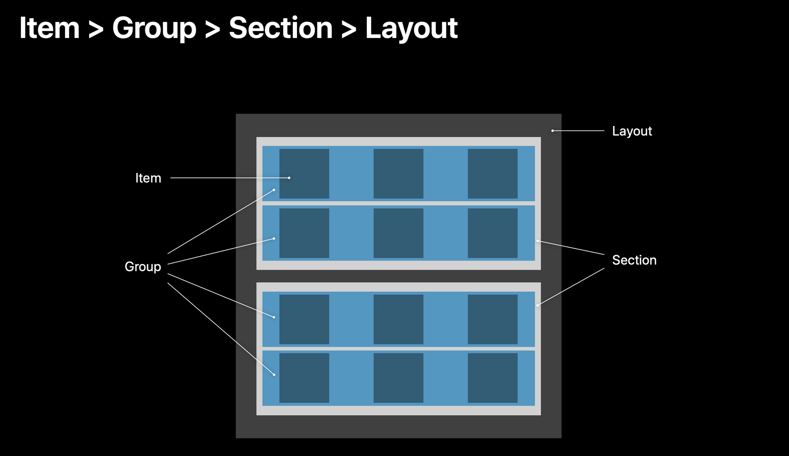
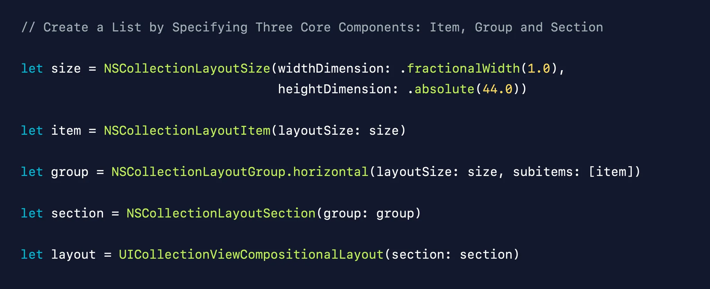

# 리스트 및 그리드 뷰 구성해보기 (고급)

## DiffableDataSource CompositionalLayout 개념

- 기존 UICollectionView 구현의 한계

### 데이터

- 이 강의에서는 다루지 않았지만, 새 데이터를 가져와 기존의 UI를 갱신할 때, 크게 두 가지 방법이 주로 사용되어 왔던 것 같다.
  1. 데이터 소스를 수정하고, performBatchUpdates 등을 통해 UI에서도 변경된 데이터들을 수정해 Sync해줌
  2. 데이터 소스를 수정하고, 뷰에 대해 reloadData를 호출해, 전체 UI를 갱신하는 방식으로 Sync 해줌
- 첫 번쨰 방식은 가끔 `NSInternalInconsistencyException` 예외가 발생했고, 두 번쨰 방식은 다시 전체 UI를 그리기 때문에 성능상 문제나 애니메이션 문제 등이 있었던 것 같다.
  - 다양한 트러블슈팅 문서들
    - https://yoojin99.github.io/app/Diff-원리/
    - https://fangpenlin.com/posts/2016/04/29/uicollectionview-invalid-number-of-items-crash-issue/
    - https://how-mrk.tistory.com/entry/Error-NSInternalInconsistencyException
- 강의와, 강의에서 인용하는 WWDC19의 210 섹션에서는 이러한 문제의 원인을 데이터 소스도 갱신하고, UI도 따로 갱신해줘야하는 점에서 찾는다.
- 따라서 중앙화된 단 하나의 Truth Data를 바라보도록 하는 새로운 접근 방식이 제시되었고, `UICollectionViewDiffableDataSource`가 등장했다.

#### `UICollectionViewDiffableDataSource`

- 개션
  - 기존: IndexPath를 통해 오브젝트를 선택해 업데이트 하는 performBathUpdates()
  - 도입: 데이터를 스냅샷 단위로 취급하고, apply()를 통해 변경분을 자동으로 추려 업데이트
- **Snapshot?**
  - 한가지의 참인 데이터를 관리하는 객체
  - 섹션 및 아이템를 Unique ID(-> Hashable)로 구분하여 스냅샷 사이의 변경분을 계산
  - IndexPath를 사용할 필요가 없어짐
  - 아이템 구현 예시
    ```swift
    struct MyModel: Hashable {
      let id = UUID()
      func hash(into hasher: inout Hasher) {
        hasher.combine(id)
      }
      static func == (lhs: MyModel, rhs: MyModel) -> Bool {
        return lhs.id == rhs.id
      }
    }
    ```
    - 다만 구조체의 경우 Hashable을 채택만 하면 멤버 값들을 비교해 해싱해주는 방식으로 컴파일러가 구현해준다.
- 참고
  - [WWDC19 - Advances in UI Data Sources](https://developer.apple.com/videos/play/wwdc2019/220/)
  - [Kodeco iOS tutorial - Collection View and Diffable Data Source](https://www.kodeco.com/8241072-ios-tutorial-collection-view-and-diffable-data-source)

### 레이아웃

- 출시되어 있는 앱들을 보면 더 다양한 화면 구성을 가지고 있다
- 단순히 고정된 크기의 셀의 반복으로는 구현하기 어려운 화면들이 많다 -> UICollectionViewFlowLayout의 한계
- 예를 들어 앱스토어 메인과 같은 화면의 경우, 이전에는 CustomLayout을 그때마다 구현해줘야 했다
- 디자이너와 개발자의 회의 릴레이
- 대안으로 CompositionalLayout이 등장했다.

#### ``UICollectionViewCompositionalLayout`



- 전체 레이아웃은 여러 섹션으로 이뤄진다
- 섹션은 여러 그룹으로 이뤄진다
- 그룹은 여러 아이템으로 이뤄진다



  - UICollectionViewFlowLayout -> UICollectionViewCompositionalLayout

- 참고
  - [WWDC19 - Advances in Collection View Layout](https://developer.apple.com/videos/play/wwdc2019/215/)

## 결론

- AS-IS
  - 데이터소스: `UICollectionViewDataSource`: Data, Presentation 업데이트시 까다로움, 예외 발생 가능
  - 레이아웃: `UICollectionViewFlowLayout`: 복잡한 Layout은 구현 난이도가 높음
- TO-BE
  - 데이터소스: `UICollectionViewDiffableDataSource`
  - 레이아웃: `UICollectionViewCompositionalLayout`

## 애플 프레임워크 그리드뷰

- 이전에 작성했던 프로젝트에 `UICollectionViewDiffableDataSource`와 `UICollectionViewCompositionalLayout`을 적용해본다.
- 프로퍼티에 dataSource: 를 잡아주고, Section과 Item 타입을 준비한다.
  ```swift
  typealias Item = AppleFramework // 가독성을 위해 AppleFramework 타입을 Item 타입 앨리어스로 잡아준다.
  enum Section { // 열거형은 그 자체로 Hashable하다
    case main
  }
  var datasource: UICollectionViewDiffableDataSource<Section, Item>!

  // 또한 AppleFramework가 Hashable 프로토콜을 따르도록 수정
  ```
- viewDidLoad()에서 datasource를 초기화해준다.
  ```swift
  class FrameworkListViewController: UIViewController {
    var datasource: UICollectionViewDiffableDataSource<Section, Item>!

    // ...

    override func viewDidLoad() {
      super.viewDidLoad()

      // ...

      datasource = UICollectionViewDiffableDataSource<Section, Item>(collectionView: collectionView, cellProvider: { collectionView, indexPath, item in
          guard let cell = collectionView.dequeueReusableCell(withReuseIdentifier: "FrameworkCell", for: indexPath) as? FrameworkCell else {
              return nil
          }
          
          cell.configure(item)
          
          return cell
      })

      // ...
    }

    // ...
  }
  ```
  - \* Kodeco 튜토리얼에서는 datasource 프로퍼티를 lazy로 선언하고, 인스턴스 메서드를 통해 초기화하는 방법을 소개했다.
    ```swift
    class FrameworkListViewController: UIViewController {
      private lazy var datasource: UICollectionViewDiffableDataSource<Section, Item> = createDatasource()

      // ...

      override func viewDidLoad() {
        super.viewDidLoad()

        // ...
      }

      private func createDatasource() -> UICollectionViewDiffableDataSource<Section, Item> {
        let datasource = UICollectionViewDiffableDataSource<Section, Item>(collectionView: collectionView, cellProvider: { collectionView, indexPath, item in
            guard let cell = collectionView.dequeueReusableCell(withReuseIdentifier: "FrameworkCell", for: indexPath) as? FrameworkCell else {
                return nil
            }
            
            cell.configure(item)
            
            return cell
        })
        
        return datasource
      }

      // ...
    }
    ```
    - 강의에서 제시된 방식은 ! 연산자로 datasource 객체를 언래핑하고 있다. viewDidLoad()에서 초기화하기 때문에 문제 여지는 적지만, 실수가 발생할 수 있는 부분이다.
    - 여러모로 위의 예제가 조금 더 좋은 프랙티스 같다.
- viewDidLoad()에서 snapshot을 만들고 datasource에 apply한다.
  ```swift
  var snapshot = NSDiffableDataSourceSnapshot<Section, Item>()
  snapshot.appendSections([.main])
  snapshot.appendItems(list, toSection: .main)
  datasource.apply(snapshot)
  ```
  - 한 개의 section을 만들고, 기존 데이터들을 아이템으로 할당했다.
- viewDidLoad()에서 UICollectionViewCompositionalLayout을 초기화하고 collectionView.collectionViewLayout에 할당한다.
  ```swift
    class FrameworkListViewController: UIViewController {

      // ...

      override func viewDidLoad() {
        super.viewDidLoad()

        // ...


      }

      // ...

      private func createLayout() -> UICollectionViewCompositionalLayout {
          /*
          section
            item item item
            [ ]  [ ]  [ ] -> group
            [ ]  [ ]  [ ] -> group
            [ ]  [ ]  [ ] -> group
          */
          
          // fractionalWidth, fractionalHeight: 자신을 포함하는 그룹/섹션에 대해 상대적인 너비, 높이를 지정
          let itemSize = NSCollectionLayoutSize(widthDimension: .fractionalWidth(0.33), heightDimension: .fractionalHeight(1)) // 아이템 너비 = 그룹 전체 너비의 1/3, 아이템 높이 = 그룹 전체 높이와 동일
          let item = NSCollectionLayoutItem(layoutSize: itemSize)
          
          let groupSize = NSCollectionLayoutSize(widthDimension: .fractionalWidth(1), heightDimension: .fractionalWidth(0.33)) // 그룹 너비 = 섹션 전체 너비와 동일, 그룹 높이 = 섹션 전체 너비의 1/3
          let group = NSCollectionLayoutGroup.horizontal(layoutSize: groupSize, subitem: item, count: 3) // Deprecated
          // let group = NSCollectionLayoutGroup.horizontal(layoutSize: groupSize, repeatingSubitem: item, count: 3) // >= iOS 16
          
          let section = NSCollectionLayoutSection(group: group)
          section.contentInsets = NSDirectionalEdgeInsets(top: 0, leading: 16, bottom: 0, trailing: 16)
          
          let layout =  UICollectionViewCompositionalLayout(section: section)
          
          return layout
      }

      // ...
    }
  ```
  - 차례대로 아이템에 대한 레이아웃, 그룹에 대한 레이아웃, 섹션에 대한 레이아웃을 정한다.

## 명상 컨텐츠 리스트

- 디자인
  - 재사용 셀(UICollectionViewCell 하위 타입들)의 디자인을 코드로 지정하기
    ```swift
    override func awakeFromNib() {
        super.awakeFromNib()
        
        self.contentView.backgroundColor = .systemIndigo
        self.contentView.layer.cornerRadius = 10
    }
    ```
    - awakeFromNib()을 오버라이딩해 오브젝트가 메모리에 로드 되었을 때 초기화 코드를 실행할 수 있다. awakeFromNib()은 [NSObject](https://developer.apple.com/documentation/objectivec/nsobject/1402907-awakefromnib)의 메서드이다.
    - UICollectionViewCell의 프로퍼티인 contentView를 참조해 셀에 대한 디자인을 수정할 수 있다.
- 레이아웃
  - `UICollectionViewCompositionalLayout`를 만들 때 아이템, 그룹 사이즈를 지정하는 방법은 세 가지가 있다. [참고](https://developer.apple.com/documentation/uikit/nscollectionlayoutdimension)
    ```swift
    private func createLayout() -> UICollectionViewCompositionalLayout {
        let itemSize = NSCollectionLayoutSize(widthDimension: .fractionalWidth(1), heightDimension: .estimated(50))
        let item = NSCollectionLayoutItem(layoutSize: itemSize)
        // width: 그룹 너비 전체 => .fractionalWidth(1)
        // height: 기본 50 예상. 그러나 컨텐츠에 따라 계산 필요 => .estimated(50)
        //         꼭 인자가 50일 필요는 없음
        //         + .absolute(_)로 절대값을 넣어줄 수도 있음.
        
        let groupSize = NSCollectionLayoutSize(widthDimension: .fractionalWidth(1), heightDimension: .estimated(50))
        let group = NSCollectionLayoutGroup.vertical(layoutSize: groupSize, subitems: [item])
        
        let section = NSCollectionLayoutSection(group: group)
        section.contentInsets = NSDirectionalEdgeInsets(top: 10, leading: 20, bottom: 10, trailing: 20)
        section.interGroupSpacing = 10 // 그룹 사이의 간격
        
        let layout = UICollectionViewCompositionalLayout(section: section)
        return layout
    }
    ```
    1. `.absolute(_)`: 정확한 수치
    2. `.estimated(_)`: 변경 가능한 수치. 넘긴 인자로 초기 사이즈를 지정하고, 시스템에서 실제 사이즈를 다시 측정한다.
    3. `.fractionalWidth(_)`, `fractionalHeight(_)`: 상대적인 수치. 자신을 포함하는 컨테이너의 수치에 대한 비율을 지정할 수 있다.

## 스포티파이 구매뷰

- 구현 결과
  ```swift
  import UIKit

  class PaywallViewController: UIViewController {
      @IBOutlet weak var collectionView: UICollectionView!
      @IBOutlet weak var pageControl: UIPageControl!
      
      let bannerInfos: [BannerInfo] = BannerInfo.list
      let colors: [UIColor] = [.systemPurple, .systemOrange, .systemPink, .systemRed]
      
      // 1. Presentation: DataSource
      enum Section {
          case main
      }
      
      typealias Item = BannerInfo
      
      private lazy var datasource: UICollectionViewDiffableDataSource<Section, Item> = createDatasource()
      
      override func viewDidLoad() {
          super.viewDidLoad()
          
          pageControl.numberOfPages = bannerInfos.count
          
          // 2. Data: Snapshot
          var snapshot = NSDiffableDataSourceSnapshot<Section, Item>()
          snapshot.appendSections([.main])
          snapshot.appendItems(bannerInfos, toSection: .main)
          datasource.apply(snapshot)
          
          // 3. Layout: Compositional Layout
          collectionView.collectionViewLayout = createLayout()
          collectionView.alwaysBounceVertical = false // 세로 스크롤 비활성화
      }
      
      private func createDatasource() -> UICollectionViewDiffableDataSource<Section, Item> {
          return UICollectionViewDiffableDataSource(collectionView: collectionView) { collectionView, indexPath, item in
              guard let cell = collectionView.dequeueReusableCell(withReuseIdentifier: "BannerCell", for: indexPath) as? BannerCell else {
                  return nil
              }
              
              cell.configure(item)
              cell.backgroundColor = self.colors[indexPath.item] // 배경색 설정
              
              return cell
          }
      }
      
      private func createLayout() -> UICollectionViewCompositionalLayout {
          let itemSize = NSCollectionLayoutSize(widthDimension: .fractionalWidth(1), heightDimension: .fractionalHeight(1))
          let item = NSCollectionLayoutItem(layoutSize: itemSize)
          
          let groupSize = NSCollectionLayoutSize(widthDimension: .fractionalWidth(0.8), heightDimension: .absolute(200))
          let group = NSCollectionLayoutGroup.horizontal(layoutSize: groupSize, subitems: [item])
          
          let section = NSCollectionLayoutSection(group: group)
          // section.orthogonalScrollingBehavior = .continuous // 섹션 너비에 구해받지 않고 수평 방향으로 이어서 스크롤; orthogonal: 직교, 수직/수평
          // section.orthogonalScrollingBehavior = .groupPaging // 한 번에 한 그룹씩 페이징 (왼쪽 정렬)
          section.orthogonalScrollingBehavior = .groupPagingCentered // 한 번에 한 그룹씩 페이징 (가운데 정렬)
          section.interGroupSpacing = 20
          section.visibleItemsInvalidationHandler = { (visibleItems, scrollOffset, layoutEnvironment) in
  //            print("items = \(visibleItems)")
  //            print("offset = \(scrollOffset)")
  //            print("env = \(layoutEnvironment)")
  //            print("env->container->contentSize = \(layoutEnvironment.container.contentSize)")
  //            print("offset.x / contentSize.width = \(scrollOffset.x / layoutEnvironment.container.contentSize.width)")
              let contentWidth = layoutEnvironment.container.contentSize.width
              let ratioAdjusted = (scrollOffset.x / contentWidth) + 0.1 // 실제로 해보니 마지막 페이지의 경우 2.4 정도에 걸려서 인덱스가 변하지 않았다. 0.1 정도를 더해 보정해줬다.
              let index = Int(ratioAdjusted.rounded())
              print("current index = \(index)")
              self.pageControl.currentPage = index
          }
          
          let layout = UICollectionViewCompositionalLayout(section: section)
          return layout
      }
  }
  ```
- `orthogonalScrollingBehavior`
  - 위에서, 그룹을 horizontal로 초기화했음에도 그룹들이 아래로 붙게 되어 마치 수직 스크롤처럼 된다. 강의에서는 그 이유를 그룹의 너비가 컬렉션 뷰 너비의 0.8을 차지하기 때문에 아래로 붙게 되는 것이라고 설명한다.
  - 이때 orthogonalScrollingBehavior를 .continuous, .groupPaging, .groupPagingCentered 등으로 설정하면 수평으로 붙게 된다.
  - 다만, [문서](https://developer.apple.com/documentation/appkit/nscollectionlayoutsectionorthogonalscrollingbehavior)에서는 특정 섹션은 기본적으로 컬렉션 뷰의 scrollDirection 프로퍼티를 따라 배치되는데, orthogonalScrollingBehavior는 이 프로퍼티와는 상관 없이 스크롤 동작을 지정할 수 있는 프로퍼티라고 설명하고 있다. 사이즈?와는 관련이 없어보이는 이야기다. 조금 더 찾아볼 필요는 있겠다.
  - 아무튼 이 예제에서는 그룹의 너비를 0.8로 해두고, 이 프로퍼티를 .groupPagingCentered로 지정해 가운데 정렬되어 페이징되도록 했다.
- `visibleItemsInvalidationHandler`
  - [문서](https://developer.apple.com/documentation/appkit/nscollectionlayoutsection/visibleitemsinvalidationhandler)에 따르면 레이아웃 사이클 시작 전에 호출되는 클로져로, 오브젝트 표시 전 수정 작업을 여기서 수행할 수 있다고 한다.
  - 취지와는 조금 다르게 이 예제에서는 현재 몇 번 인덱스의 아이템이 포시되고 있는지를 계산하고 pageControl을 업데이트하는 용도로 사용했다. 아이템들이 수평으로 가로질러 배치되어 있기 떄문에, 스크롤 할 때마다 이 핸들러가 실행되기 떄문이다.
  - 강의에서는 `let index = Int((scrollOffset.x / contentWidth).rounded())`로 계산했는데, 마지막 아이템의 ( index=3)경우 반올림 전 값이 2.4xxx여서 올림되지가 않았다. 올림을 할까 하다가 그럼 너무 민감하게 pageConrol이 업데이트 될 것 같아서, 0.1을 더해 보정하는 식으로 수정했다.
- 과제
  - 애플의 [예제](https://developer.apple.com/documentation/uikit/views_and_controls/collection_views/implementing_modern_collection_views)를 다운로드해 돌려보고 리뷰
