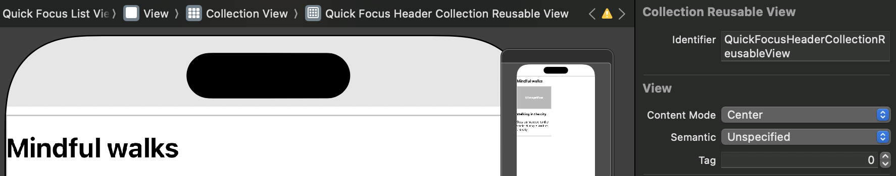

# 상세 뷰로 진입하거나, 새로운 뷰 띄워보기

## 개요

### 모달

- [HIG](https://developer.apple.com/kr/design/human-interface-guidelines/modality)
- 모달은 순간 사용자의 집중이 필요한 상황에서 활용된다. 즉, 중요한 정보를 노출하거나 사용자의 액션을 요구하는 경우, 컨텍스트를 잠시 변경하고 싶은 경우
- 따라서 모달을 닫거나 빠져나갈 수 있는 방법을 항상 제시해야 함

### 네비게이션

- [HIG](https://developer.apple.com/design/human-interface-guidelines/navigation-and-search)
- 네비게이션은 사용자 선택에 따라 뷰 자체가 전환되는 것
- 사용자가 개미지옥에 빠지지 않게 계층을 잘 정리하고 사용자의 탐색을 도와야 함

## 구현

### 모달

#### 시스템

- [alert](https://developer.apple.com/design/human-interface-guidelines/ios/views/alerts/)
- [activity views](https://developer.apple.com/design/human-interface-guidelines/ios/views/activity-views/)
- [share sheets](https://developer.apple.com/design/human-interface-guidelines/ios/extensions/sharing-and-actions)
- [action sheets](https://developer.apple.com/design/human-interface-guidelines/ios/views/action-sheets/)

#### 직접 커스텀 모달 구현 (present)

- 구현 방법: 뷰 컨트롤러의 `present(_:animated:completion:)` 호출. 참고: [UIKit - UIViewController::prensent](https://developer.apple.com/documentation/uikit/uiviewcontroller/present(_:animated:completion:))
- 스타일([UIKit - UIModalPresentationStyle](https://developer.apple.com/documentation/uikit/uimodalpresentationstyle))
    - `.automatic` -> 기본값 `.pageSheet`
    - `.fullscreen`
    - `popover`
    - `pageSheet`, `formSheet`
    - `currentContext`
    - `custom`

### 네비게이션

#### 주요 스타일

- Hierarchical Navigation
    - ex> 설정 앱
- Flat Navigation
    - ex> 탭바 앱
- Content-Drive or Experience-Driven Navigation
    - 컨텐츠 + 추천 로직
    - 아마존 상품 페이지
- 대부분 앱에서는 다양한 방식을 조합해 적용

#### 주요 원칙

- **사용자가 언제나 명확한 이동경로를 파악할수 있게 해라**
- 정보 구조를 사용자가 이해하기 쉽고 빠르게 접근하도록 디자인 해야함
- 사용자 제스쳐를 충분히 사용해라
    - 예를 들면, 스와이프백
- iOS 에서 제공하는 네비게이션 주로 사용할것
    - 네비게이션 컨트롤러, 탭바컨트롤러 등등
- 네비게이션바를 이용해서 현재 어떤 컨텍스트인지 잘 보여주기
- 탭바를 이용해서 카테고리, 또는 기능별로 나누어서 표시해라
- 아이패드에서는 탭바 보다, 스플릿 뷰를 써라
- 여러 페이지가 있는 경우, 페이지 컨트롤을 써라

#### 구현

- 탭바 (`TabbarController`) (앞에서 배웠음)
- 네비게이션 컨트롤러 (`NavigationController`) (이번에 다룸)

## 애플 프레임워크 프로젝트 + 모달

- Main 뷰 컨트롤러의 컬렉션 뷰 Delegate되고 있는 것 확인
    ```swift

    class FrameworkListViewController: UIViewController {
        // ...
        override func viewDidLoad() {
            super.viewDidLoad()
            
            // ...
            
            collectionView.delegate = self
        }
        // ...
    }

    extension FrameworkListViewController: UICollectionViewDelegate {
        func collectionView(_ collectionView: UICollectionView, didSelectItemAt indexPath: IndexPath) {
            let framework = list[indexPath.item]
            print(">>> selected: \(framework.name)")
        }
    }
    ```
- 모달로 띄울 뷰를 위한 새로운 스토리보드 `Detail` + 뷰 컨트롤러 `FrameworkDetailViewController` 생성
    - 스토리보드에 Identifier 입력
    - 스토리보드로 디자인
      - 이미지뷰와 타이틀, 설명 레이블은 스택 뷰 안에 View를 쌓아두고, 그 안에 배치
      - 이미지의 경우 그냥 스택 뷰에 넣으면 꽉 차게 배치되기 떄문...
    - 뷰 컨트롤러에 컴포넌트들 연결하고 FrameworkData를 받아 컴포넌트 업데이트하는 메서드 작성
        ```swift
        class FrameworkDetailViewController: UIViewController {
            var framework: AppleFramework = .init(name: "Unknown", imageName: "", urlString: "", description: "")
            
            
            @IBOutlet weak var imageView: UIImageView!
            @IBOutlet weak var titleLabel: UILabel!
            @IBOutlet weak var descriptionLabel: UILabel!
            
            override func viewDidLoad() {
                super.viewDidLoad()
                updateContents()
            }
            
            func updateContents() {
                imageView.image = UIImage(named: framework.imageName)
                titleLabel.text = framework.name
                descriptionLabel.text = framework.description
            }
        }
        ```
- Main 뷰 컨트롤러의 `collectionView(_:didSelectItemAt:)`에서 위에서 만든 뷰 컨트롤러 가져와 업데이트하고 present
    ```swift
    func collectionView(_ collectionView: UICollectionView, didSelectItemAt indexPath: IndexPath) {
        let framework = list[indexPath.item]
        // print(">>> selected: \(framework.name)")
        
        // FrameworkDetailViewController 표시
        let storyboard = UIStoryboard(name: "Detail", bundle: nil)
        let controller = storyboard.instantiateViewController(withIdentifier: "FrameworkDetailViewController") as! FrameworkDetailViewController // ID를 통해 초기화한 후 다운캐스팅
        controller.framework = framework // 데이터 주입
        // controller.modalPresentationStyle = .fullScreen // 지정하지 않으면 iOS에서는 .pageSheet
        
        self.present(controller, animated: true) // 모달 표시
    }
    ```
    - 이 상태에서 시뮬레이터를 띄워 아이템들을 탭해보면 모달이 표시되는 것이 확인됨
- `FrameworkDetailViewController`에 버튼 탭 이벤트 추가 -> 인앱 사파리 뷰
  ```swift
  import UIKit
  import SafariServices

  class FrameworkDetailViewController: UIViewController {
      /// ...
      
      @IBAction func learnMoreTapped(_ sender: Any) {
          guard let url = URL(string: framework.urlString) else {
              return
          }
          
          let safari = SFSafariViewController(url: url) // 사파리 뷰 컨트롤러를 초기화
          self.present(safari, animated: true)
      }
  }
  ```

## 명상 컨텐츠 리스트 + 네비게이션

- Main 뷰 컨트롤러의 컬렉션 뷰 Delegate되고 있는 것 확인
    ```swift
    class FocusViewController: UIViewController {
        // ...
        override func viewDidLoad() {
            super.viewDidLoad()
            
            // ...
            
            collectionView.delegate = self
        }
        // ...
    }

    extension FocusViewController: UICollectionViewDelegate {
        func collectionView(_ collectionView: UICollectionView, didSelectItemAt indexPath: IndexPath) {
            let item = items[indexPath.item]
            print(">>> selected: \(item.name)")
        }
    }
    ```
- 네비게이션으로 띄울 새로운 스토리보드 `QuickFocusL` + 뷰 컨트롤러 `QuickFocusListViewController` 생성
    - 스토리보드에 Identifier 입력
    - 스토리보드로 컬렉션 뷰 그리고 제약조건 걸기
      - 이전에 컬렉션 뷰 만들던거랑 똑같음
      - 셀 만들고, 커스텀 클래스 `QuickFocusCollectionViewCell` 작성해 바인딩
      - 커스텀 클래스에 셀 내 컴포넌트 연결하고, QuickFocus를 인자로 받아 UI를 업데이트하는 configure 메서드 작성
      - `QuickFocusListViewController`에 컬렉션 뷰 연결하고 세팅
        ```swift
        // class QuickFocusListViewController: UIViewController 

        let breathingList = QuickFocus.breathing
            let walkingList = QuickFocus.walking
            
            enum Section: CaseIterable { // CaseIterable -> allCases
                case breathing
                case walking
                
                var title: String {
                    switch self {
                    case .breathing: return "Breathing exercises"
                    case .walking: return "Mindful walks"
                    }
                }
            }
            typealias Item = QuickFocus
            
            var dataSource: UICollectionViewDiffableDataSource<Section, Item>!
            
            override func viewDidLoad() {
                super.viewDidLoad()
                
                // Presentation
                self.dataSource = initDataSource()
                
                // Data
                var snapshot = NSDiffableDataSourceSnapshot<Section, Item>()
                snapshot.appendSections(Section.allCases)
                snapshot.appendItems(breathingList, toSection: .breathing)
                snapshot.appendItems(walkingList, toSection: .walking)
                dataSource.apply(snapshot)
                
                // Layout
                collectionView.collectionViewLayout = initLayout()
            }
            
            private func initDataSource() -> UICollectionViewDiffableDataSource<Section, Item> {
                return UICollectionViewDiffableDataSource<Section, Item>(collectionView: collectionView) { collectionView, indexPath, item in
                    guard let cell = collectionView.dequeueReusableCell(withReuseIdentifier: "QuickFocusCollectionViewCell", for: indexPath) as? QuickFocusCollectionViewCell else {
                        return nil
                    }
                    
                    cell.configure(item)
                    
                    return cell
                }
            }
            
            private func initLayout() -> UICollectionViewCompositionalLayout {
                
                let itemSize = NSCollectionLayoutSize(widthDimension: .fractionalWidth(0.5), heightDimension: .estimated(50)) // 높이가 컨텐츠마다 다름
                let item = NSCollectionLayoutItem(layoutSize: itemSize)
                
                let groupSize = NSCollectionLayoutSize(widthDimension: .fractionalWidth(1), heightDimension: .estimated(50))
                let group = NSCollectionLayoutGroup.horizontal(layoutSize: groupSize, subitem: item, count: 2)
                group.interItemSpacing = .fixed(10)
                
                let section = NSCollectionLayoutSection(group: group)
                section.contentInsets = .init(top: 30, leading: 20, bottom: 30, trailing: 20)
                section.interGroupSpacing = 20

                let layout = UICollectionViewCompositionalLayout(section: section)
                return layout
            }
        ```
        - 섹션이 두 개인 것에 주목
          - `Section`은 `CaseIterable`을 채택해 allCases로 모든 멤버를 참조할 수 있게 함
          - section.contentInsets 지정해 섹션 사이 간격 둠
        - 한 그룹이 한 행이 되는 구성으로, 한 그룹에 두 아이템이 들어가도록 함
        - 컨텐츠 길이에 따라 높이가 달라질 수 있어 아이템과 그룹의 높이를 .estimated로 잡음
      - 이쯤에서 collectionView(_:didSelectItemAt:)에 self.present를 이용해 새로 만든 뷰를 미리 볼 수 있음. 아래에서 네비게이션으로 바꿀 것임.
- 섹션에 대한 헤더 만들기  
    
  - QuickFocus 스토리보드의 컬렉션 뷰의 셀 위에(사실 위치는 크게 상관 없을 듯) `CollectionReusableView` 추가
  - 안에 제목을 넣을 레이블을 넣어둠
  - `UICollectionReusableView`를 상속하는 `QuickFocusHeaderCollectionReusableView`를 만들고 커스텀 클래스로 추가. Identifier도 동일하게 부여
    - `QuickFocusHeaderCollectionReusableView`에는 제목이 들어갈 레이블을 연결하고 `title: String`을 받아 제목을 업데이트하는 configure 메서드 구현
  - `QuickFocusListViewController`로 돌아와서 다음 추가
    - viewDidLoad  
      ```swift
      // class QuickFocusListViewController: UIViewController 

      override func viewDidLoad() {
          super.viewDidLoad()
          
          // Presentation
          self.dataSource = initDataSource()
          
          // **** HERE ****
          dataSource.supplementaryViewProvider = { collectionView, kind, indexPath in
              guard let headerView = self.collectionView.dequeueReusableSupplementaryView(ofKind: UICollectionView.elementKindSectionHeader, withReuseIdentifier: "QuickFocusHeaderCollectionReusableView", for: indexPath) as? QuickFocusHeaderCollectionReusableView else {
                  return UICollectionReusableView()
              }
              
              let section = Section.allCases[indexPath.section]
              
              headerView.configure(title: section.title)
              
              return headerView
          }
          // ****************
          
          // ...
      }
      ```
    - 데이터소스의 `supplementaryViewProvider`에 아까 만든 재사용 뷰를 꺼내와 초기화하는 클로져 할당
    - `ofKind`를 `UICollectionView.elementKindSectionHeader`로 지정해 섹션 헤더에 대한 보조 뷰임을 명시하는 것 같음.
    - dequeueReusableSupplementaryView 메서드를 통해 재사용 뷰를 불러옴
    - ItemPath에는 현재 섹션의 인덱스가 section 멤버로 포함되어 있음. configure로 전달해 UI 초기화
    - 불러온 재사용 뷰를 반환
  - `initLayout`
    ```swift
    private func initLayout() -> UICollectionViewCompositionalLayout {
        
        // ...
        
        let section = NSCollectionLayoutSection(group: group)
        section.contentInsets = .init(top: 30, leading: 20, bottom: 30, trailing: 20)
        section.interGroupSpacing = 20
        
        // **** HERE ****
        let headerSize = NSCollectionLayoutSize(widthDimension: .fractionalWidth(1), heightDimension: .absolute(20))
        let header = NSCollectionLayoutBoundarySupplementaryItem(layoutSize: headerSize, elementKind: UICollectionView.elementKindSectionHeader, alignment: .top)
        section.boundarySupplementaryItems = [header]
        // **************

        let layout = UICollectionViewCompositionalLayout(section: section)
        return layout
    }
    ```
    - 헤더 뷰의 사이즈를 정의하고, section에 할당 (`section.boundarySupplementaryItems = [header]`)
- 네비게이션 추가
  - Main 스토리보드로 돌아와서 Focus 뷰 선택 후, Editor - Embed in - Navigaton Controller
  - `FocusViewController`로 돌아와서 `collectionView(_:didSelectItemAt:)`에 네비게이션 추가
    ```swift
      func collectionView(_ collectionView: UICollectionView, didSelectItemAt indexPath: IndexPath) {
        let item = items[indexPath.item]

        let storyboard = UIStoryboard(name: "QuickFocus", bundle: nil) // (1)
        let vc = storyboard.instantiateViewController(identifier: "QuickFocusListViewController") as! QuickFocusListViewController // (2)
      vc.title = item.title // (3)


        // self.present(vc, animated: true)
        self.navigationController?.pushViewController(vc, animated: true) // (4)
      }
    ```
    - (1), (2)에서 스토리보드 객체를 만들고 커스텀 클래스를 참조하는 것은 모달 띄우기와 동일
    - (3)에서 뷰 컨트롤러의 [타이틀](https://developer.apple.com/documentation/uikit/uiviewcontroller/title)을 변경
    - (4)에서 네비게이션 컨트롤러에 띄울 뷰 컨트롤러를 `pushViewController`에 전달
  - `QuickFocusListViewController`의 `viewDidLoad`에 `self.navigationItem.largeTitleDisplayMode = .never`를 추가해 네비게이션 타이틀이 일반 크기로 보이도록 함
