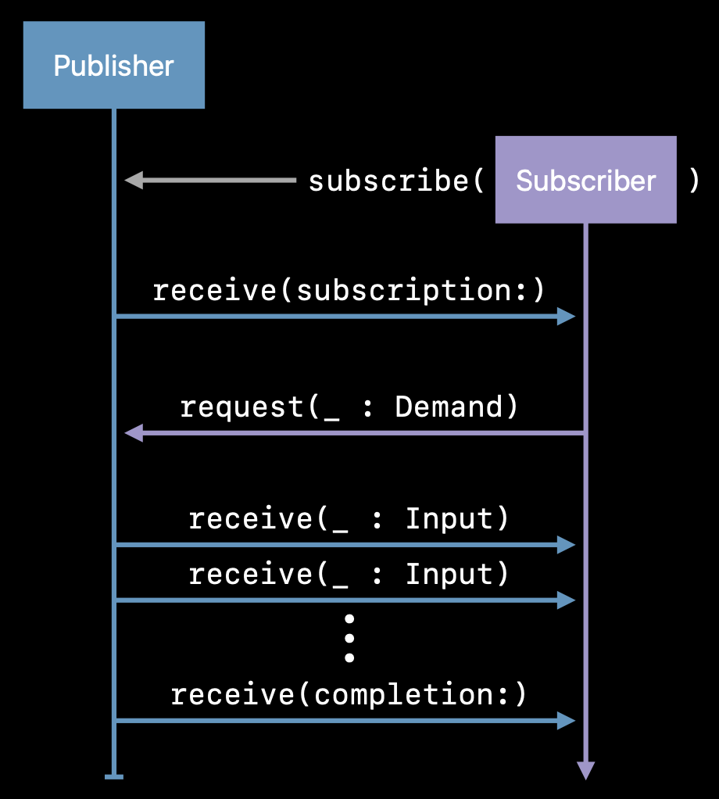

# Hello, Combine

## [Combine](https://developer.apple.com/documentation/combine) 소개

### Combine에 대해

- 리액티브 패턴으로 비동기 처리를 하기 위한 프레임워크
- 원래 Rx가 먼저 써드파티로 등장했고, 이후 애플의 Combine이 등장
- SwiftUI 내부적으로 사용되기 때문에 Combine에 대한 이해가 있으면 좋음
- 다만 iOS 13 이후부터 지원하여 이전 버전을 지원하는 경우 사용 불가 (강의 시점이 2022년이다)
  - 그래도 최소 iOS 버전과 상관 없이 아직 RxSwift를 사용하는 경우 많은 듯

### 동기와 비동기

- 동기: 요청과 응답이 순차적으로 오가는 경우
- 비동기: 요청과 응답을 순차처리하지 않는 경우

&nbsp;

- 모바일에서는 비동기 방식이 많이 사용된다.
  - 네트워크 요청: 디바이스가 위치한 네트워크 상태가 천차만별이므로 서버 응답을 무작정 기다리고 있을 수 없다
  - 사용자 인텐트에 대한 인터랙션: 사용자가 언제 어떤 버튼을 터치할지 모른다. 인터랙션을 한 시점에 한 번씩 순차적으로 처리할 수만은 없다.
- 이러한 처리를 할 수 있는 방법은 Rx나 Combine이 등장하기 전에도 여러 가지 있었다.
  - 기존의 비동기 처리 방식들
    - Target / Action
    - Notification Center
    - URLSession
    - KVO
    - Ad-hoc callbacks
  - 일관되지 않고 여러 패턴/방식이 혼용되다 보니 복잡도가 올라가는 문제가 생겼다.
- Combine(그리고 Rx도)은 이런 배경에서 탄생했다. 일관된 방식으로 비동기 처리를 수행할 수 있는 API를 제공하는 것이다. 
  - "A unified, declarative API for processing values over time"

## Combine 기본

### 개요

- 세 가지의 기본적인 컴포넌트
  1. Publisher: 생산자. 이벤트 발행.
  2. Operator: 오퍼레이터. 이벤트 가공.
  3. Subscriber: 구독자. 이벤트 소비.

### [Publisher](https://developer.apple.com/documentation/combine/publisher)

- Defines how values and errors are produced (`Output`, `Failure`)
- Value type
- Allows registration of a Subscriber

```swift
protocol Publisher {
  associatedtype Output
  associatedtype Failure: Error

  func subscribe<S: Subscriber>(_ subscriber: S)
    where S.Input == Output, S.Failure == Failure
}
```

- 빌트인 Publisher
  - [Just](https://developer.apple.com/documentation/combine/just): 값
  - [Future](https://developer.apple.com/documentation/combine/future): 클로져

- iOS 시스템에서 제공하는 Publisher
  - NotificationCenter
  - Timer
  - URLSession.dataTask

### [Subscriber](https://developer.apple.com/documentation/combine/subscriber)

- Receives values and a completion (`Input`, `Failure`)
- Reference type

```swift
protocol Subscriber {
  associatedtype Input
  associatedtype Failure: Error

  func receive(subscription: Subscription)
  func receive(_ input: Input) -> Subscribers.Demand
  func receive(completion: Subscribers.Completion<Failure>)
}
```

- 빌트인 Subscribers
  - [Assign](https://developer.apple.com/documentation/combine/subscribers/assign): Publisher가 제공한 데이터를 특정 객체의 키패스에 할당
  - [Sink](https://developer.apple.com/documentation/combine/subscribers/sink): Publisher가 제공한 데이터를 받을수 있는 클로져를 제공

### Publisher <-> Subscriber: Pattern



1. Subscriber is attached to Publisher
2. Publisher sends a Subscription
3. Subscriber requests N values
4. Publisher sends N values or less
5. Publisher sends completion

#### [Subscription](https://developer.apple.com/documentation/combine/subscription)

- Publisher와 Subscriber가 연결되었음을 표현함
- [Cancellable](https://developer.apple.com/documentation/combine/cancellable) 프로토콜을 구현하고 있어 cancel()을 호출해 작업을 중단시킬 수 있음

### [Subject](https://developer.apple.com/documentation/combine/subject)

- Publisher의 일종이다. (`Publisher`를 준수한다.)
- 일반적으로 Publisher는 내부에서 이벤트를 생산해 방출한다.
- Subject는 이와 다르게 `send()` 메서드를 통해 외부에서 값을 주입할 수 있도록 되어있다.
- 강의에도, 애플 문서에도 기존 명령형 구문을 마이그레이션하는데 적합하다고 되어있다.
  - "This can be useful for adapting existing imperative code to the Combine model."
  - 예제를 보기 전이라 자세히 알 수는 없지만, 아마도 기본 비동기 코드의 전후로 적당한 Subject를 만들고 여기에 결과값을 주입해 방출하는 식으로 해서, 큰 리팩토링 없이 Combine으로 전환하는데 도움이 된다는 의미 같다.
  - 나중에 찾찬히 확인 필요... 이 강의는 이제 막 Swift를 뗀 (레거시 코드는 당연히 모르는) 수강생에게 최첨단의 방식들을 가르치고 있다... 😭
- 두 가지 구현체
  1. `CurrentValueSubject`: 단일 값을 Subject로 래핑한다. 가장 최근 방출한 값(current value)을 가지고 있다. (value 프로퍼티)
  2. `PassthroughSubject`: 단순히 값을 받으면 방출하기만 하는 Subject의 단순한 구현체이다. `CurrentValueSubject`와는 달리 내부에 어떤 값도 들고있지 않다.

### [@Published](https://developer.apple.com/documentation/combine/published/)

- 간단하게 특정 클래스의 프로퍼티를 Publisher로 래핑해주는 [Attribute](https://docs.swift.org/swift-book/documentation/the-swift-programming-language/attributes)이다.
- cs193p 강의를 들을 때, ObservedObject에서 사용했던 것이 기억난다.
- 프로퍼티를 정의할 때 @Published를 붙여주면 된다.
- Publisher를 직접 참조하고 싶을 때엔 `$`을 접두사로 붙여 참조한다. ([참고](https://developer.apple.com/documentation/swiftui/binding/projectedvalue))

```swift
class Weather {
    @Published var temperature: Double
    init(temperature: Double) {
        self.temperature = temperature
    }
}


let weather = Weather(temperature: 20)
cancellable = weather.$temperature
    .sink() {
        print ("Temperature now: \($0)")
}
weather.temperature = 25


// Prints:
// Temperature now: 20.0
// Temperature now: 25.0
```

### [Operator](https://developer.apple.com/documentation/combine/publishers-sequence-publisher-operators)

- Publisher와 Subscriber 사이에서 값을 알맞게 가공한다.
- 따로 독립된 타입은 아니고, Publisher의 메서드로서 체이닝하여 사용한다.
- 제네릭으로 Input, Output 타입 등을 받기도 하는데, 원래 Publisher와 Subscriber의 내부 타입과 다를 수 있다. 거쳐가는 것이기 때문에.
- 역시 [Java Reactor](https://projectreactor.io/docs/core/3.7.1/api/reactor/core/publisher/Flux.html#map-java.util.function.Function-)의 Operator와 비슷한 개념인 것 같다. (위의 전체적인 개념들도 거의 유사하다)

### [Scheduler](https://developer.apple.com/documentation/combine/scheduler)

- 언제, 어떻게 클로져를 실행할지 정의한다.
- Publisher에 Scheduler를 다음과 같이 지정할 수 있다. 이를 통해 어떤 쓰레드에서 실행할 지를 정의할 수 있다.
  1. [subscribe(on:options:)](https://developer.apple.com/documentation/combine/publisher/subscribe(on:options:)): subscribe, cancel, request 작업을 수행할 스케쥴러를 지정
    - 무거운 작업은 메인 쓰레드가 아닌 다른 쓰레드에서 작업
      - 예) 백그라운드 계산이 많이 필요한것
      - 예) 파일 다운로드해야하는 경우
  2. [receive(on:options:)](https://developer.apple.com/documentation/combine/publisher/receive(on:options:)): Publisher가 방출한 요소를 받을 스케줄러를 지정
    - UI 업데이트 필요한 데이터를 메인스레드에서 받도록 지정
     - 예) 서버에서 가져온 데이터를 UI 업데이트 할때
- 스레드 그 자체인 것은 아니므로 혼동에 주의
- 예시
  ```swift
  let jsonPublisher = MyJSONLoaderPublisher() // Some publisher.

  jsonPublisher
      .subscribe(on: backgroundQueue)
      .receive(on: RunLoop.main)
      .sink { value in
        label.text = value
      }
  ```

  - Bad Practice
    ```swift
    pub.sink {
        DispatchQueue.main.async {
            // Do update ui
        }
    }
    ```

  - More Better (like above example)
    ```swift
    pub
      .receive(on: DispatchQueue.main)
      .sink {
            // Do update ui
      }
    ```

## 참고자료

- https://developer.apple.com/videos/play/wwdc2019/722/
- https://developer.apple.com/videos/play/wwdc2019/721/
- https://developer.apple.com/documentation/combine/using-combine-for-your-app-s-asynchronous-code
- https://developer.apple.com/documentation/combine/replacing-foundation-timers-with-timer-publishers
- https://developer.apple.com/documentation/combine/processing-published-elements-with-subscribers

### 더 읽을거리

- [Kodeco - Concurrency Tutorial](https://www.kodeco.com/28540615-grand-central-dispatch-tutorial-for-swift-5-part-1-2): 앞으로 비동기 작업을 깊게 파려면 GCD에 대해 이해해야할 것 같다.
