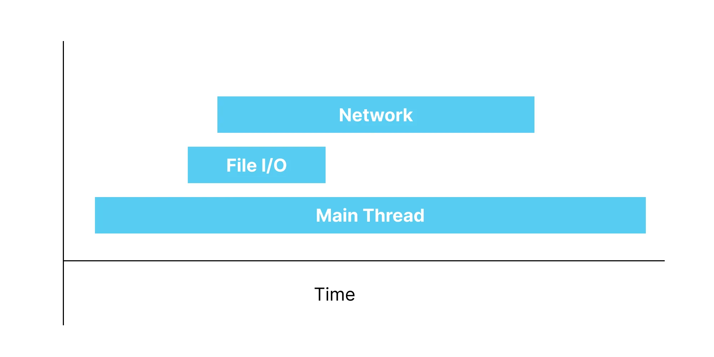
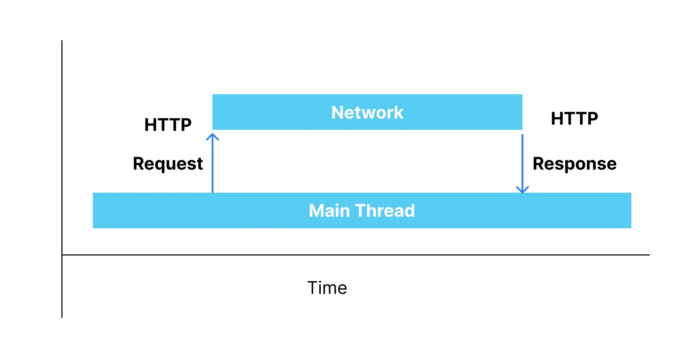

# 네트워크 이해하기

## Concurrency 동시성

- 여러 개의 작업이 동시에 일어나는 것처럼 보이게 하는 것
- 컴퓨터에서는 수많은 프로세스/스레드가 동시에 실행되고 있지만, 실제로 동시에 수행될 수 있는 연산은 한계가 있으며, 마치 동시에 처리되는 것처럼 보이게 함
- 다른 측면에서는, 여러 작업들을 순차적으로 수행하지 않고, 순서와 상관 없이 동시에 수행되도록 할 수 있음을 의미함

## 모바일 앱에서의 쓰레드

1. Main Thread: 화면 그리기와 인터렉션
  - 데이터를 UI에 보여주기
  - 버튼 클릭 이벤트 받기
2. Background: Main Thread 수행 작업 외의 것들
  - 네트워크 작업
  - DB에서 값 읽기
3. Custom Thread: 지정된 스레드를 통한 작업
  - 영상 데이터 가공, 오디오 데이터 가공 등
  - 특별히 시간과 비용이 많이 들어서 작업을 위한 전용 쓰레드를 지정해줄 필요가 있는 경우

## 동기와 비동기

- 개발할 떄의 차이
  - 동기: 요청한 지점에서 리턴이 됨
  - 비동기: 요청은 요청대로, 리턴은 리턴대로
- 예시  
    
  

## HTTP

- 서버와 대화하는 방식 중 하나
- 요청 -> 응답

### 요청

- URL  
  `scheme[http | https] :// host : port / path / to / resource ? query = value`

- 주로 사용되는 요청 메서드 (Rest 식으로 설명하고 있음)
  - GET: 존재하는 자원 요청
  - POST: 새로운 자원 생성
  - PUT: 존재하는 자원 수정 (대치)
  - DELETE: 존재하는 자원 삭제

### 응답

- Status Code
  - 2xx: 성공
  - 3xx: 리디렉션
  - 4xx: 클라이언트의 잘못된 요청으로 실패
  - 5xx: 서버 에러로 실패
- body (앱에서 많이 사용되는 것)
  - JSON
  - Image
  - ...

### 테스트

- JSON: https://api.github.com/users/0tak2
- Image: https://picsum.photos/640/480
