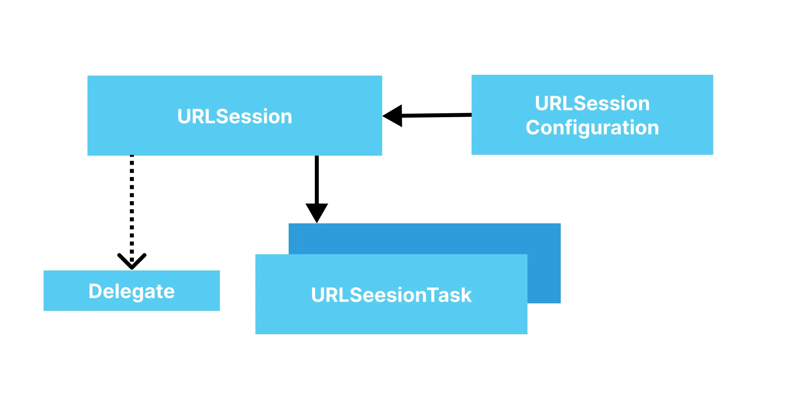

# iOS에서 네트워크 구현하기

## URLSession

- iOS에서 HTTP 통신을 도와주는 도구. Foundation에서 제공.
- 알아둬야 할 것
  - [`URLSessionConfiguration`](https://developer.apple.com/documentation/foundation/urlsessionconfiguration): URLSession에 대한 설정
    - `.default`: 기본적인 작업
    - `.ephemeral`: 캐시, 쿠키, 인증정보 등을 저장하지 않음 (ephemeral 이퍼미럴: 단명하는)
    - `.background`: 앱이 백그라운드에서 돌고 있어도 다운로드 가능
  - [`URLSession`](https://developer.apple.com/documentation/foundation/urlsession): URLSessionConfiguration에 대한 세션을 생성
  - [`URLSessionTask`](https://developer.apple.com/documentation/foundation/urlsessiontask): URLSession에서 만든 네트워크 작업
    - `URLSession::dataTask(with:)`: URLSessionDataTask instances 생성. 데이터를 요청하고 받아옴.
    - `URLSession::uploadTask(with:from:)`: URLSessionUploadTask instances 생성. 데이터를 서버에 업로드함.
    - `URLSession::downloadTask(with:)`: URLSessionDownloadTask instances 생성. 다운로드한 데이터 저장.

  

## [Codable](https://developer.apple.com/documentation/swift/codable)

- 대부분 네트워크 요청/응답 바디 형태는 JSON을 사용
- Swift 객체 <-> JSON 간 인코딩, 디코딩을 쉽게 할 수 있도록 도와주는 타입
- 참고자료
  - [Using JSON with Custom Types](https://developer.apple.com/documentation/foundation/archives_and_serialization/using_json_with_custom_types)
  - [Encoding and Decoding Custom Types](https://developer.apple.com/documentation/foundation/archives_and_serialization/encoding_and_decoding_custom_types)

## URLSession + Combine

- Combine 등장 이후, URLSession과 Combine을 같이 이용할 수 있도록 `URLSessionDataTask`에 대한 publisher 제공 ([참고](https://developer.apple.com/documentation/foundation/urlsession/processing_url_session_data_task_results_with_combine))
- 응답을 비동기적으로 처리하기 더 쉬워짐

## 실습 1 - Playground

[code](../projects/Network%20in%20iOS.playground)

## 실습 2 - 깃헙 프로필 조회

### 세팅

- 스타터 프로젝트의 Kingfisher 7.x에서 오류가 발생해 빌드가 되지 않아서 지우고 8.x를 추가헀다.
  - GithubUserProfile.xcodeproj의 GithubUserProfile 프로젝트에서 Package Dependicies - Kingfisher 버전 변경 또는 제거하고 다시 추가

### URLSession 고급

- 이전에는 URL 객체를 만든 후 URLSession에 넘겨 요청했지만, 아래와 같이 URLRequest를 넘기는 식으로 하면 더 세밀한 요청이 가능하다.
  ```swift
  let baseUrl = "https://api.github.com"
  let path = "/users/\(query)"
  let parmas: [String: String] = [:]
  let headers: [String: String] = ["Content-Type": "application/json"]

  var urlComponents = URLComponents(string: baseUrl + path)!
  let queryItems = parmas.map { key, value in
      URLQueryItem(name: key, value: value)
  }
  urlComponents.queryItems = queryItems

  var request = URLRequest(url: urlComponents.url!)
  headers.forEach { key, value in
      request.addValue(value, forHTTPHeaderField: key)
  }

  URLSession.shared.dataTaskPublisher(for: request)
  // ...
  ```
  - 쿼리 스트링 추가, HTTP 헤더 추가 등을 잘 봐두면 좋을 것 같다.
  - 또한 URLSession을 여기서 초기화하지 않고 shared를 참조해 싱글톤으로 활용했다.
- 이 강의에서는 이런 디테일한 부분에 대해서는 설명을 쏙 빼먹는데 이런 부분이 많이 아쉽다...

### 기타

- 강의에서는 Operator나 Subscriber에 클로져를 넘길 때 내부에 self를 그대로 strong 캡쳐해 참조하는데, 메모리 누수 걱정을 하지 않아도 되는지 모르겠다. 일단은 weak 캡쳐로 고쳐 썼다.

## 실습 3 - 깃험 사용자 검색

- [안 보고 해본 SearchViewController](https://github.com/0tak2/ios-study/blob/768cbb9d9a3623fc8caee584786794fd34b39367/fc-ios-bible/part5-network/projects/GithubUserSearch/GithubUserSearch/View/SearchViewController.swift)

- 거의 비슷했다. [수정 diff](https://github.com/0tak2/ios-study/commit/4af0d26737abd076179b14b0bad2b2ebf7094870)

- 강의에서 Combine을 활용하는 부분이 인상깊었다.
  ```swift
  URLSession.shared.dataTaskPublisher(for: request)
    .map { $0.data }
    .decode(type: SearchUserResponse.self, decoder: JSONDecoder())
    .map { $0.items }
    .replaceError(with: [])
    .receive(on: RunLoop.main)
    .assign(to: \.users, on: self)
    .store(in: &subscriptions)
  ```
