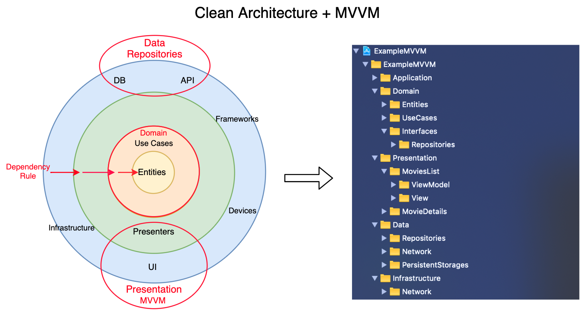

# MVVM을 넘어서서

## 여러 디자인 패턴

- MVP, VIPER, Ribs, Elm...
- 심지어 MVVM에도 여러 파생이 있다 - MVVM-Coordinator, MVVM-ViewState 등

## 혼란

- 어떤 걸 공부해야 하는가
- 디자인패턴을 포함한 기술들은 수단이지, 목적이 아니다
- 본질은 문제를 어떻게 해결하는가에 있다

## 클린아키텍쳐

- [요약 아티클](https://blog.coderifleman.com/2017/12/18/the-clean-architecture/)
  - 레이어를 나누자
  - 안쪽 레이어는 바깥 쪽 레이어를 모르도록 해라
- iOS에서 클린아키텍쳐 도입
  - [구현](https://github.com/kudoleh/iOS-Clean-Architecture-MVVM)
  - [아티클](https://tech.olx.com/clean-architecture-and-mvvm-on-ios-c9d167d9f5b3)

  

  - Layers
    - Domain Layer = Entities + Use Cases + Repositories Interfaces
    - Data Repositories Layer = Repositories Implementations + API (Network) + Persistence DB
    - Presentation Layer (MVVM) = ViewModels + Views

  - Dependency Direction

    

- 예시 유즈케이스: 사용자가 검색창을 통해 영화를 검색하면 화면에 검색 결과가 노출된다
  - 검색 화면 - 프레젠테이션
  - 검색 화면에 검색어 타이핑 - 프레젠테이션
  - 검색어를 받아 서버에 검색 요청
    - 뷰에서 유저 인텐트 처리: 프레젠테이션 -> 도메인
    - 서버에 데이터 요청: 도메인 -> 데이터
  - 검색 결과가 화면에 노출됨
    - 서버 응답 받음: 데이터
    - 응답 디코딩: 데이터
    - 디코딩된 데이터 전달: 데이터 ..> 도메인
    - 디코딩된 데이터를 영화 모델로 변환: 도메인
    - 영화 모델 전달: 도메인 ..> 프레젠테이션
    - UI요소에 전달받은 내용을 그림: 프레젠테이션

## 결론

- 디자인패턴보다 더 원론적인 접근
- 화려한 용어와 편의 기능을 갖춘 프레임워크를 도입하기 전에, 전체 비즈니스를 적절한 레이어로 구분해 책임을 나누고 단방향 의존성을 지키는 것이 중요
- 여러 도구는 당장은 편리해보여도 본질적으로 또 다른 의존성이라는 것을 주의해야 함

### 더 생각해보기

- iOS에서의 SOLID 원칙 ([아티클](https://medium.com/@jgj455/오늘의-swift-상식-객체와-solid-원칙-270415c64b64))
- 200-10 규칙
  - 클래스는 200줄 안으로, 메서드는 10줄 안으로 작성하도록 노력하자
  - 분량이 늘어난다면 뭔가 잘못 설계한 것은 아닌지 의심해볼 필요. SOLID를 어겼거나 책임이 분명하지 않거나...
